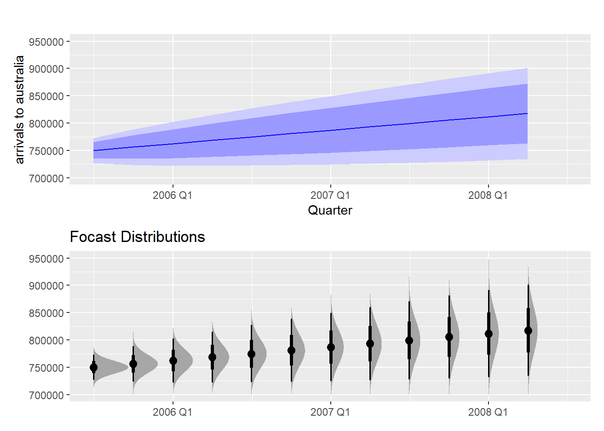

```{r, echo=FALSE, include=FALSE}
#Loading of necessary libraries
library(dplyr)    # alternatively, this also loads %>%
library(fpp3)
library(patchwork)
# library(gganimate)
library(tsibble)

#Loading datasets
austa <- readr::read_csv("http://OTexts.com/fpp3/extrafiles/austa.csv") %>%
  as_tsibble(index = Year)
melsyd <- tsibbledata::ansett %>%
  filter(Airports == "MEL-SYD")
```

# References

1. Wooldridge, Jeffrey M. 2006. *Introductory Econometrics: A Modern Approach.*, chapter 1.3.
2. Shumway & Stoffer 2017. *Time Series Analysis and its Applications with R examples*.
3. Hyndman, R.J., & Athanasopoulos, G., 2021. *Forecasting: principles and practice*. 3rd edition.
4. Bersetkas and Tsitsiklis 2008. *Introduction to Probability.*
5. Tezanos, J.F., 2008 *La explicación sociológica: una introducción a la Sociología*.
6. Jerry D. Gibson and Jaewoo Jung, 2006. *The Interpretation of Spectral Entropy Based Upon Rate Distortion Functions*. IEEE International Symposium on Information Theory, pp. 277-281.
7. Goerg, G. M, 2013. *Forecastable Component Analysis*. Journal of Machine Learning Research (JMLR) W&CP 28 (2): 64-72.
8. Ziya Xu, Jingshu Chen, Lu Xu, Wanyu Wang, 2012. *A Parallel Digital Hardware Generator of White Gaussian Noise Stressing on Crest Factor*.
9. Lantz, Brett, 2019. *Machine Learning with R. Expert techniques for predictive modeling*.
10. Grattan Institute, 2013. *Budget Pressures on Australian Governments*.

## Note

This notebook is by not original material, but rather put together with information from the sources given above.

# Types of data

This section introduces the most relevant data-structures encountered in economics and social sciences. The student might already be familiar with these concepts, but they are included as a refresher due to their importance.

Reference [1] is followed closely in the definitions given below.

## Cross-Sectional Data

Consists of a **set of variables** <span style="color: red;">**randomly collected**</span> **from a population** of individuals, households, firms, cities, states, countries or a variety of other units, taken **at a given point in time**.

```{r, echo=FALSE, out.width='60%', fig.align="center", fig.cap="Cross-sectional data set on wages and other individual characteristics. From [1]"}

```

**Question**: ¿more examples of cross sectional data?

## Time-series Data

Corresponds to **observations of one or several variables over time**. 

Because past events can influence future events, in this case **the data are not independent** and **time periodicity** is extremely relevant in the analysis.

Anything that is observed sequentially over time is a time series. We will only consider time series that are observed at regular intervals of time (e.g., hourly, daily, weekly, monthly, quarterly, annually), although there are time series sampled at irregular intervals (outside the scope of this course).

**The frequency at which data is collected** is extremely relevant (daily, weekly, monthly, yearly...).
  
**Examples:**

* Number of births per month in New York city
```{r, echo=FALSE, out.width='70%', fig.align="center", fig.cap="number of births per month in New York city"}
births <- scan("http://robjhyndman.com/tsdldata/data/nybirths.dat")
birthstimeseries <- ts(births, frequency=12, start=c(1946,1))
plot.ts(birthstimeseries)
```

**Question**: ¿more examples of time series data?

* Stock prices
* Money supply
* Annual crime rates.
* Sales figures
* ...

## Pooled cross-sectional Data

**Randomly sampled cross sections** collected at **different points in time and pooled together.**

Pooling cross-sections obtained at different points in time results in datasets that have **both cross-sectional and time series features**.

**Important notes:**

* Pooling makes sense if cross-sections are randomly sampled.
* Pooling cross-sections from different years is commonly used to analyze the effectiveness of implemented policies.

**Examples**:

* Housing prices taken in two different years.

```{r, echo=FALSE, out.width='60%', fig.align="center", fig.cap="Pooled Cross Sections: two years of housing prices. From [1]"}

``` 

* Households sampling
  + **One random sample of households** in 2005 for economic variables.
  + **New random sample of households** in 2010 surveyed for the same variables.
  + Combining the two years results in a **pooled cross section**.
  
* **Question**: more examples?

  + Current Population Survey in 2010 and 2020.

## Panel Data or longitudinal data

Observations of **cross-sections of the same units** (individuals, households, firms, countries, geogr. locations...) at **different points in time.**

In other words: a **time series** (or set of time series) for **each member of the cross-section in the data set**.

Examples:

* Crime Statistics for different years in the same cities.

```{r, echo=FALSE, out.width='60%', fig.align="center", fig.cap="Two-year panel Data Set on City Crime Statistics. From [1]"}

```

* National Longitudinal Survey of Youth (NLSY).

## Pooled cross-sectional vs Panel Data

* **Panel data** is obtained from the **same cross-sectional units** (individuals, firms, countries...) followed over a given time period.

* **Pooled cross-sectional data** is obtained from **different randomly-sampled cross-sections** for each point in time.
  + Example: 
      * Housing prices measured in two different years are not considered panel data because the houses sold each year are likely to be different.

# Time series and stochastic processes

See reference [2] for further details on this part.

**Stochastich process** is a commonly used term in time-series analysis that is important to briefly clarify.

A **time-series** can be defined as a **<span style="color: red;">collection of random variables</span> <span style="color: blue;">*indexed according to the order they are obtained in time (t)*</span>**.

**Example**: $y_1, y_2, y_3...$ where $y_1$ is the value taken at the first point in time, $y_2$ at the second point in time, etc...

**A collection of random variables $\{y_t\}$** indexed by $t$ is referred to as a **<span style="color: red;">stochastic process</span>**.

**Examples**

```{r, echo=FALSE, out.width='80%', fig.align="center", fig.cap="Gaussian noise. From ref [8]"}
knitr::include_graphics('./figs/1_different_gaussians.png')
```

```{r, echo=FALSE, out.width='80%', fig.align="center", fig.cap="Gaussian vs non-gausian noise. From ref [8]"}

```

**Question** in the previous graphs, are the random variables independent and identically distributed? Why?

```{r, echo=FALSE, out.width='80%', fig.align="center", fig.cap="Example of stochastic process of non-independent variables"}

```

## Stochastic process vs. realization of a stochastic process

The **observed values of a stochastic process** are a **realization of the stochastic process**. This distinction is derived from the random nature of the stochastic process.

Usually no explicit distinction is made between process and realization because the context makes it clear whether the process itself or a realization of the process is being referred to.

## Time-series and event-independence

See references [2] and [4].

**EXAMPLES OF INDEPENDENT EVENTS**:

* Situations where the outcome of A and B is determined by two physically distinct and non-interacting processes.
  + Weather in new years day and flip of a coin
  
* Subsequent flips of a coin,

* Subsequent throws of a dice.

* White noise.

## Independent identically distributed (iid) variables and statistical methods

Most conventional statistical methods are based upon the assumption that the events involved in the phenomena studied are ***independent and identically distributed (iid)***. 

Recall for example the most prevalent limit theorems: the **Law of Large Numbers (LLN)** and the **Central Limit Theorem (CLT)**, foundational in most conventional statistical methods:

### Law of Large Numbers (weak formulation)

  Let X1, X2, ... be ***independent identically distributed*** random variables with **mean $\mu$. For every $\epsilon > 0$, we have:
  
\[
  P(|M_n - \mu| \geq \epsilon ) = P\left( \left\lvert \frac{X_1+...+X_n}{n} -\mu \geq \epsilon \; \right\rvert \right) \rightarrow 0 \;\;\;\;\; as\;n\; \rightarrow \infty
\]

For large n, the bulk of the distribution $M_n$ is concentrated near $\mu$.

### Central Limit Theorem

*Let $X_1, X_2,...$ be a sequence of **independent identically distributed** random variables with **common mean $\mu$ and variance $\sigma^2$**, and define*:

\[
  Z_n = \frac{X_1 + ... + X_n - n\mu}{\sigma\sqrt{\mu}}
\]

\noindent
\makebox[\linewidth]{centered text}

*then the Cummulative Density Function (CDF) of $Z_n$ converges to the standard normal CDF*

\[
  \Phi(z) = \frac{1}{2\pi}\int_{-\infty}^{z} e^{-x^2/2}dx
\]

\noindent
\makebox[\linewidth]{centered text}

*in the sense that*


\[
  \lim_{n \to \infty} P(Z_n \leqslant z) = \Phi(z) \;\;for\;every\;z
\]
  
**NOTE:**

There are variations of the Law of Large Numbers and the Central Limit Theorem that are applicable to situations where data is not independent and hence are applicable to Time Series, but they exceed the scope of this course.

This section wants to bring attention to the fundamental nature of the iid hypothesis in conventional statistical methods.

### Time-series and the iid hypothesis

Because **past events or past states of a system tend to influence future events**, there will be a certain amount of correlation between the realization of the collection of random variables that comprise the stochastic process of the time series.

That is: **the random variables that form the stochastic process of the time series are NOT independent identically distributed under general conditions**. We will explore this in detail when we talk about **autocorrelation**:

* **Correlation** measures the **extent of a linear relationship between two variables.** 
* **Autocorrelation** measures the **linear relationship between lagged values of a time series.**

**Time Series Analysis** can be referred to as the <span style="color: red;">***systematic approach to answer the mathematical and statistical questions posed by these time correlations.***</span>

```{r}

```

# Forecasting vs Prediction

See reference [9] as well as the following interesting article:

* https://www.datascienceblog.net/post/machine-learning/forecasting_vs_prediction/
  
## Predictive models

In machine Learning, a **predictive model** uses values in the dataset to predict another value. The **goal** is to find a relationship between the **target feature** being predicted and the **other features** in the dataset.

Although the word **prediction** is used in common language to imply **forecasting**, <span style="color: red;">*a predictive model does not necessarily foresee events in the future*</span>. Examples of such machine learning predictive models could be:

* A classifier to identify numbers based on the pixel decomposition of the number images.
* A classifier that predicts whether an applicant is financially trustworthy for a loan or not.
* A regression model used to predict the engine speed based on other engine performance features.
* A regression model that predicts the income of a person.

**NOTE: regression vs classification**

* The output of **regression predictive model** is a numeric prediction for the specific unit of the dataset under study.
* The output of a **classifier predictive model** is a class to which the specific unit under study belongs.

## Forecasting models

```{r, echo=FALSE, out.width='60%', fig.align="center", fig.cap="Forecasts as a subset of predictions"}

```

**Forecasting** can be understood as a **subset of prediction** in which <span style="color: red;">**time-series data** is used to make **predictions about the</span> <span style="color: blue;">future</span>**.

**The difference between prediction and forecasting** is the inclusion of **time as a key feature in the prediction.**

* Time orders the observations of each feature from oldest to most recent. 
  + **This ordering is information of utmost importance in the forecasting process.**

Forecasting time series data consists in producing estimates about the future of the sequence of observations. The figure below shows the quarterly Australian beer production from 2000 to the second quarter of 2010.

```{r, echo=FALSE, out.width='80%', fig.align="center", fig.cap="Austrialian quarterly beer production forecast. From [3]"}

```

* **Blue lines:** forecasts for the next two years
  + Seasonal patterns have been captured and replicated.
* **Dark shaded region**: shows 80% prediction intervals (future values expected to lie in that region with 80% probability).
* **Light shaded region**: shows 95% prediction intervals.

## Example: weather forecasting

**Weather prediction**: 

Weather prediction would simply consider the **atmospheric features influencing the weather** and create a model to predict the weather based on these atmospheric features **without considering their temporal dimension**.

**Weather forecasting**:

Weather forecasting considers the **atmospheric features influencing the weather** as well as **their temporal dimension** to say something about the future weather based on past observations and the specific order in which these observations where registered.

**Example**: 

Rainy day combined with an oddly high atmospheric pressure (usually associated with clear skies). 

A **prediction model** would probably tell you that it is unlikely to rain in 10 minutes time due to the high atmospheric pressure, despite the fact that it is currently raining.

A **forecasting model** would tell you that it is likely to rain in 10 minutes despite the high atmospheric pressure because it is currently raining and it has been raining during the last minutes.

# Forecastability

## Factors influencing forecastability

In forecasting it is important to know when something can be forecast accurately and when forecasts will be no better than tossing a coin.

Something is easier to forecast if:

1. We have a **good understanding of the factors that contribute to it**.
2. There is **a lot of data available**.
3. The **future is somewhat similar to the past**.
4. **Forecasts do not affect what we are trying to forecast**.

* **Timing of next Halley's comet appearance:**
  + <span style="color: green;">+ Very precise understanding of the contributing factors: gravitaty law + initial conditions</span>
  + <span style="color: green;">+ Rich databases of historical observations.</span>
  + <span style="color: orange;">+ Safe to assume that conditions used to integrate the laws of physics in the past will remain applicable in the future, but some perturbations might not be fully accounted for (other cosmic events/undetected bodies...)</span>.
  + <span style="color: green;">+ Being a natural phenomenon, the forecasts have no psychological effect whatsoever.</span>  

* **Electricity demand:**
  + <span style="color: orange;">+ Good understanding of contributing factors: temperatures with smaller effects of calendar variations (holidays) and economic conditions</span> 
  + <span style="color: green;">+ Several yeras of data on electricity demand available, and many decades of data on weather conditions</span>
  + <span style="color: orange;">+ For short-term forecasting it is safe to assume that demand behavior will be similar to past behavior</span>  
  + <span style="color: green;">+ For most residential users the price electricity is not dependent on demand, and so the forecasts on demand have little to no effect on consumer behavior</span>

* **Exchange rates $US/AUS next week:**
  + <span style="color: red;">- Limited understanding of the factors affecting exchange rates</span>
  + <span style="color: red;">- The future may very well be different from the past (crises...)</span>
  + <span style="color: green;">+ Lots of historical data available</span>
  + <span style="color: red;">- Forecasts of the exchange rate have a direct effect on the rates themselves. These forecasts are self-fulfilling, people will adapt the price they are willing to pay. In a sense, the exchange rates become their own forecasts (**efficient market hypothesis**)</span>

* **Election results:**
  + <span style="color: red;">- Limited understanding of the factors affecting the vote</span>
  + <span style="color: red;">- The future may very well be different from the past (crises...)</span>
  + <span style="color: green;">+ Historical data available</span>  
  + <span style="color: red;">- Forecasts about election results strongly influence voting direction</span>
      * **José Felix Tezanos:** *public forecasts about any social situation (e.g. election polls) become themselves part of the situation and consequently affect the subsequent events* (Tezanos, 2008).

## Signal to Noise Ratio

See reference [2] for this section.

Typically we will not have direct data about that which we wish to study. It will be obscured by noise.

The ratio of the amplitude of the signal (the meaningful information) to the noise contained in the information is sometimes referred to as the *signal-to-noise ratio (SNR)*. In economics, the underlying signal may be a trend or a seasonal component of a series.

**The larger the SNR**, the easiest it is to detect the signal and hence to make predictions about it.

```{r, echo=FALSE, out.width='70%', fig.align="center", fig.cap="Example of increasing Signal-to-Noise Ratio"}
cs = 2*cos(2*pi*1:500/50 + .6*pi); w = rnorm(500,0,1)
par(mfrow=c(3,1), mar=c(3,2,2,1), cex.main=1.5)
plot.ts(cs, main=expression(2*cos(2*pi*t/50+.6*pi)))
plot.ts(cs+w, main=expression(2*cos(2*pi*t/50+.6*pi) + N(0,1)))
plot.ts(cs+5*w, main=expression(2*cos(2*pi*t/50+.6*pi) + N(0,25)))
```
In **time series decomposition** we will further explore some of the possible approaches to uncovering the underlying signal components within the data.

### Spectral entropy (Shannon Spectral Entropy)

Although it will not be used in the course, entropy is a feature of time series which can be used as a possible measure of how easy the series is to forecast. It is related to the Signal-to-Noise Ratio as follows:

* **Series with strong trend and seasonality** (hence easy to forecast) have an **entropy close to 0**
* **Very noisy series** (difficult to forecast) have an **entropy close to 1**

The concept exceeds the extent of this course, but there are readily available functions in R to compute it. For example `feat_spectral` from the `feasts` package.

For the curious reader, have a look at the following link:

* https://feasts.tidyverts.org/reference/feat_spectral.html

# Statistical forecasting perspective:

The further ahead we forecast, the greater the uncertainty about the forecast. In most forecasting situations the variation associated with what we are trying to forecast shrinks as the event approaches.

## Forecasts as a random variable

We have already seen that a **time-series** can be defined as a **<span style="color: red;">collection of random variables</span> <span style="color: blue;">*indexed according to the order they are obtained in time (t)*</span>**.

The future values of the time series we are trying to forecast are random variables that can take *a range of possible values*. Until we have a realization of each particular random variable, they remain a random quantity.

To account for the random mathematical nature of what we are trying to forecast, we could take two approaches.

## Multiple futures

```{r, echo=FALSE, out.width='80%', fig.align="center", fig.cap="Millions of visitor to australia. Multiple futures forecast. Ref [3]"}

```

**Question**: what would be a more statistical manner to approach this "potential futures"?

* Given the random variable nature of time series data, a prediction interval would be more desirable.

## Prediction intervals

Due to the random variable nature of what we are trying to forecast, prediction intervals provide more information. The figure below shows: 

* 80% (dark blue) and 95% (light blue) confidence intervals for the future Australian international visitors.
* Average of all the possible future values, called **point forecasts** (blue line). Further clarified below.

```{r, echo=FALSE, out.width='80%', fig.align="center", fig.cap="Millions of visitor to australia. Confidence interval forecast. Ref [3]"}

```

```{r, echo=FALSE, out.width='80%', fig.align="center", fig.cap="visualization of the forecast distributions"}

```

## Point forecasts and Forecast Distribution

```{r, echo=FALSE, out.width='60%', fig.align="center", fig.cap="Normal forecast distribution and prediction intervals."}
knitr::include_graphics('./figs/forecast_distr_3.png')
```

**$y_t$** random variable to be forecast. Subscript $t$ indicates observation at time $t$

**Prediction interval or interval forecast**: a range of values of $y_t$ with a given probability to occur

**Forecast Distribution**:

* $I$ denotes all the information observed prior to time t.
* $y_t|_I$ is the random variable $y_t$ given what we know in $I$
* The **forecast distribution** is the **probability distribution of $y_t|_I$**, that is the **set of values this random variable could take** along with **their relative probabilities**.
* The **forecast variance** is **var[$y_t|_I$]**

**Point forecast**: the **mean (or median if we decide so) of $y_t|_I$**, the **average value of the forecast distribution**

* When talking about "the forecast" we usually refer to this value.
  + We put a $\hat{}$ over $y$ to denote this. 
  + The *forecast of* $y_t$ is $\hat{y_t}$ (the average of the possible values $y_t$ could take given what we know in $I$)

**Specifying information used in calculating the forecast**:

* **$\hat{y_t}_{|t-1}$:** forecast of $y_t$ taking account of all previous observations $(y_1,...,y_{t-1})$
* **$\hat{y_{T+h}}_{|T}$:** forecast of $y_{T+h}$ taking account of $(y_1,...,y_T)$. That is: an **h-step ahead forecast** taking into account all observations up to time T.

**Most important concepts**:

* **Forecast distribution** as the **set of values $y_t|_I$ could take** along with **their relative probabilities**.
* **Point forecast** as the **average value of the forecast distribution**

# Explanatory vs. Time-series vs. Mixed models

## Explanatory models

A model based on predictor variables. Called "explanatory" because it helps "explain" the causes of the phenomenon under study.

* **Example**: electricity demand of a hot region during the summer period

\[
  ED = f(current\;temperature,\;strength\;of\;economy,\;population,\;time\;of\;day,\;day\;of\;week,\;error).
\]

The relationship **will not be exact**. The "error" term allows for **random variation** and **effects of relevant variables not included in the model**

## Time series models

A suitable time series forecasting equation is of the form:

\[
  ED_{t+1} = f(ED_{t},\;ED_{t-1},\;ED_{t-2},\;ED_{t-3},\;...,\;error).
\]

Based on **past values of a variable**, but **not on external variables that may affect the system**.

### Mixed model

Combines features of both models. 

Example:

\[
ED_{t+1} = f(ED_{t}, current\;temperature,\;strength\;of\;economy,\;population,\;time\;of\;day,\;day\;of\;week,\;error).
\]

**Another example:** weather forecasting model that takes into account both atmospheric variables relevant for the forecast as well as past values of the weather.

## Comparison

**Explanatory model** incorporates information about other variables rather than just historical values of the variable to be forecast.

Sometimes less is indeed more and there are sitations were **a time series model might be preferred over a mixed or explanatory model**:

1. System might not be well understood.
2. Difficulty in measuring predictor variables governing its behavior.
3. It is necessary to know or forecast the future values of the various predictors in order to forecast the variable of interest. This may be difficult in itself.
4. Main goal could be to **predict what will happen** and **not why it will happen** (no need for explanatory model).
5. Time series model may give more accurate forecasts than an explanatory or mixed model (importance of testing the model).

# Sample cases

## The difficulty of forecasting

**Budget forecasts** are dependent on **economic forecasts**.

```{r, echo=FALSE, out.width='80%', fig.align="center", fig.cap="Forecasting: hopes vs reality. Ref [3]"}

```

Bias of forecasts depend strongly on the economic situation:

* 2000s: budget outcomes were often about 1 per cent of GDP better than forecast
* After 2008 Great Financial Crisis: overestimation of budget outcome by about 1 per cent of GDP

```{r, echo=FALSE, out.width='80%', fig.align="center", fig.cap="Forecasting: hopes vs reality. Ref [10]"}

```

From reference [10]:

* *"Before the Financial Crisis of 2008 treasury tended to underestimate the strength of growth in the global and Australian economies, and in terms of trade, causing it to underestimate taxation revenue."*

* *"Treasury has generally overestimated the budget outcome by about 1 per cent of GDP. About half of this due to overestimating the strength of global and Australian economic growth"*.

## Psychology of a Market Cycle

In market contexts where uncertainty reigns, psychology can play a major role. The cycle below occurs more often than you would expect in these situations:

```{r, echo=FALSE, out.width='80%', fig.align="center", fig.cap="The wall street cycle."}

```

**Question**: Can you give an example of a market that reproduced this cycle?

A very clear example of this cycle could be the all time high of bitcoin in 2017 (already surpassed). In a market where retail investors had a lot of weight, the cycle reproduced accurately:

```{r, echo=FALSE, out.width='100%', fig.align="center", fig.cap="Bitcoin 2017 bull run and subsequent price fall."}

```

**Question**: what would you trust more in this context?

* Time-series model?
* Explanatory model?
* Expert judgement?
* Your brother-in-law telling you to keep buying?

## External events

```{r, echo=FALSE, out.width='100%', fig.align="center", fig.cap="Air passengers between Australia's main cities. Ref[3]"}
knitr::include_graphics('./figs/1_passengers_australia.png')
```

* There was a period in 1989 when no passengers were carried — this was due to an industrial dispute.
* There was a period of reduced load in 1992. This was due to a trial in which some economy class seats were replaced by business class seats.
* A large increase in passenger load occurred in the second half of 1991.
* There are some large dips in load around the start of each year. These are due to holiday effects.
* There is a long-term fluctuation in the level of the series which increases during 1987, decreases in 1989, and increases again through 1990 and 1991.

Any model will need to take all these features into account in order to effectively forecast the passenger load into the future.

```{r, echo=FALSE, out.width='100%', fig.align="center", fig.cap="Air passengers growht globally."}

```

* Globally the effect of the local events seem to even out. However, if we extended the time series until the COVID pandemic the information of the previous years, however precise, would not be able to predict the sharp decline in air traffic.