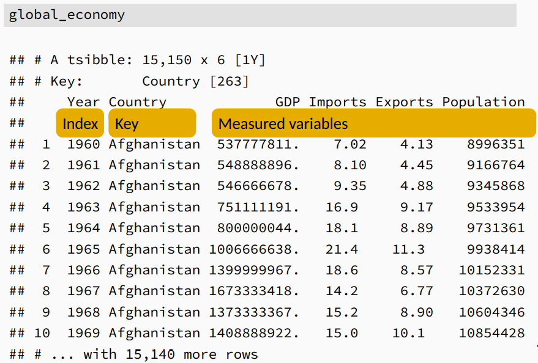
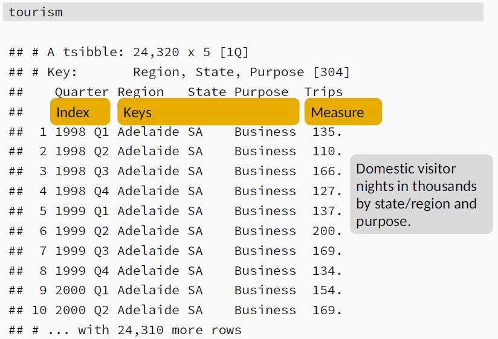

```{r, echo=FALSE, include=FALSE}
library(kableExtra)
```

# `tsibble` objects

## Installation

```{r, eval=FALSE}
install.packages("fpp3") 
# Installs several packages, among others the tsibble package
```

## Libraries used:

```{r, error=FALSE, warning=FALSE, message = FALSE}
library(fpp3)

# Loads the flights data set.
library(nycflights13)
```
## tsibble data structure

A *tsibble* is a time series object much easier to work with than `ts`, `xts` and other alternatives available in R. It **extends the concept of tibble**, adding additional properties that make it particularly fit for time series data.

**Time series**: sequential **registers of measurements** (for one or several variables) **over time** for **one or several observational units**

A tsibble object structures data in the following manner;

1. **An index**, which is a **variable with inherent ordering from past to present** (time-related)
2. **A key**, which is a **variable or set of variables** that **identifies observational units** unambiguously (optional).
3. **Measured variables**: numbers of interest.

Each **observation** is **uniquely identified** by a combination of **index** and **key**

```{r, echo=FALSE, out.width='60%', fig.align="center", fig.cap="Global Economy Data. From [1]"}

```

```{r, echo=FALSE, out.width='60%', fig.align="center", fig.cap="Australia Tourism Data. From [1]"}

```

## Creating a tsibble

### tsibble():

```{r}
data_1 <- tsibble(
  year = 2012:2016,
  y = c(123, 39, 78, 52, 110),
  index = year
)
data_1
```

Note the line `A tsibble 5 x 2 [1Y]` The **[1Y]** indicates the frequency of the data sampling and helps us identify we are in fact dealing with a tsibble. 

### as_tsibble():

We could also coherce an existing tibble or data.frame to a tsibble using `as_tsibble()`

```{r}
data_1 <- tibble(
  year = 2012:2016,
  y = c(123, 39, 78, 52, 110)
) %>%
as_tsibble(index = year)

data_1
```

### Index variable: frequency of observations and time class functions.

For observations that are more frequent than once per year, we need to use a time class function on the index.

```{r, echo=FALSE}
test <- tibble(
  Frequency = c("Anual", "Quartetly", "Monthly", "Weekly", "Daily", "Sub-daily"),
  Function = c("`start:end`", "`yearquarter()`", "`yearmonth()`", "`yearweek()`", "`as_date()`, `ymd()`", "`as_datetime()`, `ymd_hms()`")
)

knitr::kable(test, 
             caption="<center><strong>Functions for time index variables depending on frequency</strong></center>", 
             format="html"
             ) %>%
  
kable_styling(full_width = FALSE)
```

An interval is automatically obtained based on the corresponding time representation:

* `integer/numeric/ordered:` either “unit” or “year” `(Y)`
* `yearquarter/yearqtr:` “quarter” `(Q)`
* `yearmonth/yearmon:` “month” `(M)`
* `yearweek:` “week” `(W)`
* `Date:` “day” `(D)`
* `difftime:` “week” `(W)`, “day” `(D)`, “hour” `(h)`, “minute” `(m)`, “second” `(s)`
* `POSIXct/hms:` “hour” `(h)`, “minute” `(m)`, “second” `(s)`, “millisecond” `(us)`, “microsecond” `(ms)`
* `nanotime:` “nanosecond” `(ns)`

The examples that follow will hopefully bring some clarity to these concepts.

