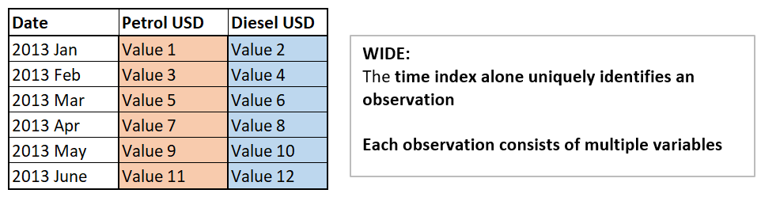
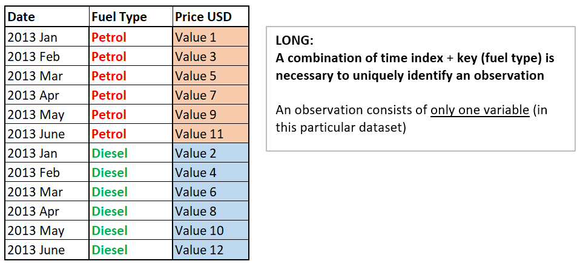

```{r}
library(fpp3)
library(readr)
library(readxl) # to import function read excel
```


## Importing data with `read_csv` and `read_xlsx`

For the following example, please create a subfolder called `datasets` in your current working directoy and place there the datasets provided for this lesson.

### Passengers dataset

```{r echo = T, error=FALSE, warning=FALSE, message = FALSE}
passengers <- readr::read_csv("ZZ_Datasets/AirPassengers.csv")
```

```{r}
passengers
```
Note that the output is a tibble. To make it a tsibble, we need to convert the column month to a time index format. Since we are dealing with monthly data, we will use `yearmonth()`

```{r}
passengers <- passengers %>%
  
  # Transform the time varialbe from chr to yearmonth()
  mutate(Month = yearmonth(Month)) %>%
  
  # Rename the column #Passengers to have a better name (good practice)
  rename(n_pasengers = `#Passengers`)

# Convert to a tsibble
passengers <- as_tsibble(passengers, index = Month)

# Check result
passengers
```
Let us now create the time plot with `autoplot` (from the tsibble library)

```{r}
autoplot(passengers, n_pasengers)
```

### Beijing pollution

```{r echo = T, error=FALSE, warning=FALSE, message = FALSE}
pollution <- readr::read_csv("ZZ_Datasets/Beijing_Pollution_TSeries.csv")
pollution
```

As before, we would like to transform it now into a tsibble. We need to create a time_stamp that will be used as index.

Since we have the components of the date in different columns, we will use the function `make_datetime`. For details see:

https://r4ds.had.co.nz/dates-and-times.html#creating-datetimes

```{r}
pollution <- pollution %>%
  
  #Step 1: create the time_stamp
  mutate(time_stamp = make_datetime(year, month, day, hour)) %>%
  
  #Step 2: reorder columns and drop timestamp components (keep only the newly created timestamp)
  select(time_stamp, everything(), -c(No, year, month, day, hour))  %>%

  #Step 3: convert to tsibble
  as_tsibble(index = time_stamp)

pollution
```

```{r}
autoplot(pollution, NO2)
```

**Question**: what is the problem when visualizing this data?

#### Average weekly values

If we start aggregating data, we will lose time resolution, but in turn we might get some clarity:

```{r}
NO2_weekly <- select(pollution, time_stamp, NO2) %>%
  
  # Step 1: Indicate level of aggregation desired in the index. In this case
  # we will start with a weekly aggregation:
  index_by(week = yearweek(time_stamp)) %>%
  
  # Step 2: aggregate variables with the desired output
  summarise(
    average_NO2 = mean(NO2, na.rm = TRUE), # Computes the mean NO2 levels for each calendar week.
  )

NO2_weekly
```

Now lets use autoplot for the time plot. Autoplot is built on top of ggplot2, sharing similar grammar and being able to be combined with ggplo2 functions

```{r}
autoplot(NO2_weekly, average_NO2) +

# Set the grid frequency for the x axis and its label format. 
# The tsibble function scale_x_yearweek scales the x axis in CW according to the
# breaks we set
scale_x_yearweek(date_breaks = "3 month",
                  date_minor_breaks = "1 week") +

# Flip x-labels by 90 degrees
theme(axis.text.x = element_text(angle = 90))
```

#### EXERCISE 1 average monthly values:

Now you will repeat the process to aggregate monthly values (see separate excersises script)

```{r}
NO2_monthly <- select(pollution, time_stamp, NO2) %>%
  
  # Step 1: Indicate level of aggregation desired in the index. In this case
  # monthly aggregation
  index_by(Month = yearmonth(time_stamp)) %>%
  
  # Step 2: Aggregate variable with the desired output
  summarise(
    average_NO2 = mean(NO2, na.rm = TRUE),
  )

NO2_monthly
```

#### EXERCISE 2: plotting monthly aggregation

```{r}
# Autoplot function from library tsibble
autoplot(NO2_monthly, average_NO2) +

# Set the grid frequency for the x axis and its label format
scale_x_yearmonth(date_breaks = "1 month", 
                  date_minor_breaks = "1 month", # Check what happens if you comment this line
                  date_labels = "%y-%b") +

# Flip x-labels by 90 degrees
theme(axis.text.x = element_text(angle = 90))
```

#### Average quarterly values:

```{r}
NO2_quarterly <- select(pollution, time_stamp, NO2) %>% #Selecting variables of interest
  
  # Step 1: Indicate level of aggregation desired in the index. In this case
  # monthly aggregation
  index_by(Quarter = yearquarter(time_stamp)) %>%
  
  # Step 2: Aggregate variable with the desired output
  summarise(
    average_NO2 = mean(NO2, na.rm = TRUE),
  )

NO2_quarterly
```

```{r}
quarter_seq = yearquarter(NO2_quarterly[["Quarter"]][1]) + seq(0, nrow(NO2_quarterly), by = 1)
quarter_seq
```

```{r}
autoplot(NO2_quarterly, average_NO2) +

scale_x_yearquarter(date_breaks = "1 year",
                    
                    # For quarters it is best to manually construct the sequence
                    minor_breaks = quarter_seq)
```

### Singapore COVID cases

This time we will be reading from an excel file:

```{r echo = T, error=FALSE, warning=FALSE, message = FALSE}
singapore_covid <- read_xlsx("ZZ_Datasets/Covid-19_SG_NoGraphs.xlsx")
singapore_covid
```
We have a tibble. Now you will practice converting it to a tsibble.

#### EXERCISE 3: convert to a tsibble

```{r}
singapore_covid <- singapore_covid  %>%
  
  #Step 1: create Date item using ymd
  mutate(time_stamp=ymd(Date))  %>%
  
  #Step 2: select items of interest
  select(time_stamp, `Daily Confirmed`) %>%

  #Step 3: convert to tsibble
  as_tsibble(index = time_stamp)

singapore_covid
```

#### EXERCISE 4: aggregating by month

```{r}
singapore_monthly <- singapore_covid %>%
  
  # Step 1: Indicate level of aggregation desired in the index. In this case
  # monthly aggregation
  index_by(month = yearmonth(time_stamp)) %>%
  
  # Step 2: Aggregate variable with the desired output
  summarise(
    monthly_confirmed = sum(`Daily Confirmed`, na.rm = TRUE),
  )
singapore_monthly
```

#### Plotting monthly aggregation - method 1

```{r}
autoplot(singapore_monthly, monthly_confirmed) +

# Set the grid frequency for the x axis and its label format
scale_x_yearmonth(date_breaks = "3 month",
                  date_minor_breaks = "1 month",
                  date_labels = "%y-%m") +

# Flip x-labels by 90 degrees
theme(axis.text.x = element_text(angle = 90))
```

#### Plotting monthly aggregation - method 2

If we want to have a better control over the x-axis labels, the most effective method
is to generate our own monthly sequence

```{r}
#Lets define the sequence of months:
year_month_seq <- yearmonth(singapore_monthly[[1]][1]) + seq(0, nrow(singapore_monthly), by = 3)
year_month_seq
```

```{r}
autoplot(singapore_monthly, monthly_confirmed) +

# Set the grid frequency for the x axis and its label format
                  # Appropriately defined sequence
scale_x_yearmonth(breaks = year_month_seq,
                  date_minor_breaks = "1 month",
                  date_labels = "%y %b") +

# Flip x-labels by 90 degrees
theme(axis.text.x = element_text(angle = 90))
```

### Fuel weekly prices

In this case we will be dealing with an excel were that has text at the end of the
column containing dates. This will raise an error when creating a tsibble:

```{r echo = T, error=FALSE, warning=FALSE, message = FALSE}
fuel_prices <- read_xlsx("ZZ_Datasets/Weekly Fuel Prices.xlsx")

fuel_prices
```


What happened? The first column in excel is contaminated and mixes dates with a string at the end. The read_xlsx function is therefore confused about the datatype within excel of this particular column and therefore reads it as "General".

When a date in Excel is converted to "General" format, its converted to an integer number. This is because excel stores dates as sequential serial numbers so that they can be used in calculations  (actualy this approach is the standard for dealing with data operations). By default January 1st, 1900 is 1 in excel. read_xlsx() is importing the data in this format.

To fix this we can simply provide the additional argument `col_types` to the read_xlsx function (you can check all the options either in internet or using ?read_xlsx in the console).

```{r echo = T, error=FALSE, warning=FALSE, message = FALSE}
fuel_prices <- read_xlsx("ZZ_Datasets/Weekly Fuel Prices.xlsx",
                         col_types = c ("date", "numeric", "numeric"))

fuel_prices
```

There are still some problems we need to deal with in the `Date` column. 

* Irregular sampling intervals.
* NA Values.

#### Removing NA Values

Due to the formatting of the original dataframe, we may check that the last two rows of the tibble are NA values:

```{r}
# Find the location of NA values within the tibble
NAindex <- which(is.na(fuel_prices$Date))

NAindex # Index of the rows containing NA values in the date column
nrow(fuel_prices) # number of rows in fuel prices
```
Seeing the results above, it appears that it is the last rows of the dataset that are contaminated.

```{r}
tail(fuel_prices)
```

```{r}
fuel_prices <- filter(fuel_prices, !is.na(Date))

tail(fuel_prices)
```

#### Irregular time intervals

Lets compute the difference between subsequent date values. For this we will first introduce the `lag()` function to shift by 1 a vector of the tibble:

```{r}
# Date values
fuel_prices[[1]][1:5]

# Lagged date values
lag(fuel_prices[[1]], n = 1)[1:5]
```

```{r}
# Difference in time values
time_diff <- fuel_prices[[1]]- lag(fuel_prices[[1]], n = 1)
time_diff[1:5]
min(time_diff, na.rm = TRUE) # Check what happens if we remove this
max(time_diff, na.rm = TRUE) # Check what happens if we remove this
```
In conclusion, we have irregular sampling intervals. tsibble will generate problems when trying coerce this tibble to a tsibble unless we specify `regular = FALSE`.

```{r}
fuel_prices <- as_tsibble(fuel_prices, regular = FALSE, index = Date)
fuel_prices
```

#### EXERCISE 5: Converting irregular data to regular data by aggregation

Aggregating irregularly sampled data to a higher time unit (e.g. data sampled at different day intervals) can be a method to turn it into regularly data. In this case, we will aggregate to mohtly data

```{r}
fuel_monthly <- fuel_prices %>%
  
  # Step 1: Indicate level of aggregation desired in the index. In this case
  # monthly aggregation
  index_by(Month = yearmonth(Date)) %>%
  
  # Step 2: Aggregate variable with the desired output
  summarise(
    avg_petrol_USD = mean(`Petrol (USD)`, na.rm = TRUE), # Backticks for spaces in Petrol (USD)
    avg_diesel_USD = mean(`Diesel (USD)`, na.rm = TRUE) # Backticks for spaces in Diesel (USD)
  )

fuel_monthly
```

#### EXERCISE 6: autoplot with several variables

```{r}
#Lets define the sequence of months:
year_month_seq <- yearmonth(fuel_monthly[[1]][1]) + seq(0, nrow(fuel_monthly), by = 6)
year_month_seq
```

```{r}
autoplot(fuel_monthly, vars(avg_petrol_USD, avg_diesel_USD)) +

# Set the grid frequency for the x axis and its label format
                  # Appropriately defined sequence
scale_x_yearmonth(breaks = year_month_seq,
                  date_minor_breaks = "1 month",
                  date_labels = "%y %b") +

# Flip x-labels by 90 degrees
theme(axis.text.x = element_text(angle = 90))
```

##### EXAMPLE: wide to long data: `pivot_longer()`

The distinction between *wide* and *long* data is not always clear, but this dataset is a good example to illustrate it and to show the different behaviour of the autoplot function when dealing with long data.

We could consider the current formatting of this fuel prices to be wide data because for each point in time (index) we have two variables: the prices of diesel and petrol fuel. That is, two columns.

```{r, echo=FALSE, out.width='70%', fig.align="center", fig.cap="Example of wide data"}

```

We could, however, flip this and have **two observations for each point in time** that we would uniquely identify by adding a key. For each index we would only have 1 variable. The dataframe of course, would be longer. Hence the name *long*.

```{r, echo=FALSE, out.width='70%', fig.align="center", fig.cap="Example of long data"}

```

Let us *pivot* the data from wide to long format using `pivot_longer()` from the `tydyr` package. Please consider this an example and not something you need to absolutely master. We are doing this to show how longer data behaves with the `autoplot` function from `fable` that we are using throughout the lesson.

```{r}
fuel_monthly_long <- 
  fuel_monthly %>%
  
  # Renames the columns so that they are an appropriate key in long format
  rename(petrol = avg_petrol_USD, diesel = avg_diesel_USD) %>%
  
  # Piivots the data
    # names_to: indicates that the column names will be moved to a new column
    # named "Fuel"
    # values_to: indicates that the values of each obervation will be moves to
    # a new column valles "avg_price_USD".
  pivot_longer(c(petrol, diesel), names_to = "Fuel", values_to = "avg_price_USD") %>%
  
  # Updates the tsibble object, allowing us to specify a key
  update_tsibble(index = Month, key = Fuel)

# Inspect_result
fuel_monthly_long
```

The process could be reversed using the function `pivot_wider()` of the same package. As a sidenote, the `tidyr()` package is a part of `tidyverse` and has fuctions to help turn untidy data into tidy data.

##### EXAMPLE: autoplot with long data

Instead of two graphs (what we obtained with wide data) we obtain one graph and one curve per key.

```{r}
# AUTOPLOT WITH LONG DATA

autoplot(fuel_monthly_long) +

# Set the grid frequency for the x axis and its label format
                  # Appropriately defined sequence
scale_x_yearmonth(date_breaks= "6 month",
                  date_minor_breaks = "3 month",
                  date_labels = "%y %b") +

# Flip x-labels by 90 degrees
theme(axis.text.x = element_text(angle = 90))
```

## Creating a tsibble with data that has repeated time indexes and needs a key.

Let us consider the flights dataset from the `nycflights13` package loaded at the beginnig of this workbook (you might need to install it).

```{r}
library(nycflights13)
flights
```
As we can see, we have all the time information split across different columns. We want to transform this into a tsibble. For this, we need to:

1. Create a time object (date, date-time...) that will act as an index
2. Define a minimum set of labels that act as a "key" to uniquely identify the observational units.

Let us begin by creating the timestamp

```{r, error=TRUE}
flights_ts <- 
  flights %>%
  
  #Create timestamp
  mutate(time = make_datetime(year, month, day, hour, minute)) %>%
  
  #Rearrange columns and drop previous time information columns 
  select(time, everything(), -c(year, month, day, hour, minute))

flights_ts
```
As it stands, we still have a tibble. Let us try to coerce it to a tsibble:

```{r, error=TRUE}
flights_ts <- as_tsibble(flights_ts, index = time)
```

The error message is letting us know that there are repeated time indexes. If this occurs, has we have seen, we need to add a key to the tsibble data structure to uniquely identify the observational units. 

First, let us check how many indexes are repeated. We can do this by using the `duplicates()` function of the tsibble package:

```{r}
nrow(flights_ts)
nrow(duplicates(flights_ts, index = time))
```
flights_ts has 336776 rows and there are 275432 rows that have an index that repeats somewhere else in the data.

To solve this situation, we need to include the minimum amount of keys that identify uniquely the observational units and solve this lack of coherence in the data. Let us start introducing the variable `flight` (the flight number) as part of the key

```{r, error=TRUE}
flights_ts <- as_tsibble(flights_ts, index = time, key = flight)
```

We still get the same error, although this time we have a lower amount of duplicates:

```{r}
nrow(flights_ts)
nrow(duplicates(flights_ts, index = time, key = flight))
```
There are 336776 rows in the data and 226 rows have a combination of index + flight that repeats.

The reason for this is that flight numbers are made up of a code of 4 numbers preceded by the identification of the carrier. Thus, if we include the aircraft carrier as part of the key, we will now have no repetitions:

```{r}
nrow(duplicates(flights_ts, index = time, key = c(carrier,flight)))
```

And NOW we can finally coherce our data to a tsibble taking this into account:

```{r}
flights_ts <- 
  flights_ts %>% 
  
  #coerce to a tsibble
  as_tsibble(index = time, key = c(carrier, flight)) %>%
  
  #rearrange rows to have the key values at the beginning
  select(time, carrier, flight, everything())
  
flights_ts
```
