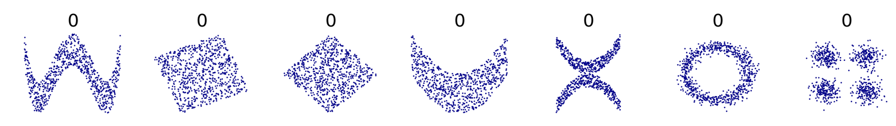
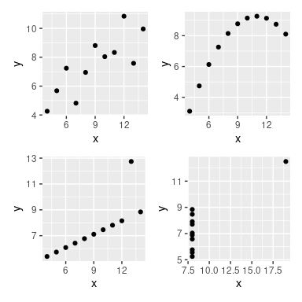

```{r, echo=FALSE, include=FALSE}
library(kableExtra)
```

# References

This is not original material but a compilation of the following sources with some additional examples and clarifications introduced by the professor:

1.  Hyndman, R.J., & Athanasopoulos, G., 2021. *Forecasting: principles and practice*. 3rd edition.
2.  Additional material provided by the book authors
3.  The Datasaurus Dozen - [Link](https://blog.revolutionanalytics.com/2017/05/the-datasaurus-dozen.html)

# Framework and packages:

We will work with the fpp3 package, developed by Prof. Rob Hyndman and his team. They are actually one of the leading contributing groups to the time series community, so do not forget their name.

This package extends the tidyverse framework to time series. For that it requires to load some packages under the hood (see output of the following cell):

```{r}
library(fpp3)
```

Additionally, for this particular session we will use the packages `GGally`, `fma` and `patchwork`. Install them if you do not have them already:

```{r, eval=FALSE}
install.packages("GGally") # to generate a scatterplot matrix
install.packages("fma") # to load the Us treasury bills dataset
install.packages("patchwork") # Used to manage the relative location of ggplots
```

```{r, error=FALSE, warning=FALSE, message = FALSE}
library(patchwork) # Used to manage the relative location of ggplots
library(GGally)
library(fma) # to load the Us treasury bills dataset
```

# Basic time series patterns and time-plots

```{r, echo=FALSE}
test <- tibble(
  Pattern = c("Trend", "Seasonal", "Cyclic"),
  Description = c("Long-term increase OR decrease in the data", "Periodic pattern due to the calendar (quarter, month, day of the week...)", "Pattern where data exhibits rises and falls that are NOT FIXED IN PERIOD (typically duration of at least 2 years)")
)

knitr::kable(test, 
             caption="<center><strong>Time series patterns</strong></center>", 
             format="html"
             ) %>%
  
kable_styling(full_width = FALSE)
```

```{r, echo=FALSE}
test <- tibble(
  Seasonal = c("Seasonal pattern of constant length", "Shorter than cyclic pattern", "Magnitude less variable than cyclic pattern"),
  Cyclic = c("Cyclic patern of variable length", "Longer than periodic pattern", "Magnitude more variable than periodic pattern")
)

knitr::kable(test, 
             caption="<center><strong>Seasonal or cyclic</strong></center>", 
             format="html"
             ) %>%
  
kable_styling(full_width = FALSE)
```


## Example 1 - trended and seasonal data

```{r}
aus_production %>%
  
  # Filter data to show appropriate timeframe
  filter((year(Quarter) >= 1980 & year(Quarter)<= 2000)) %>%
  
  autoplot(Electricity) + 
  
  # Scale the x axis adequately
  scale_x_yearquarter(date_breaks = "1 year",
                      minor_breaks = "1 year") +
  
  # Flip x-labels by 90 degrees
  theme(axis.text.x = element_text(angle = 90))
```

Strong trend with a change in the slope of the trend around 1990.

### `autoplot()` as a wrapper around ggplot2 objects

The function `autoplot()` of the library `fpp3` is nothing but a wrapper around ggplot2 objects. Depending on the object fed to autoplot, it will have one or other behavior combining different ggplot objects.

In the example above, `autoplot()` is nothing but a wrapper around `geom_line()`. It is just that using `autoplot()` is much more convenient and it is a good idea to have such a function in a time series dedicated library such as `fpp3`

```{r}
aus_production %>% 
  
  filter((year(Quarter) >= 1980 & year(Quarter)<= 2000)) %>%
  
  # The two lines below are equivalent to autoplot(Electricity)
  ggplot(aes(x = Quarter, y = Electricity)) + 
  geom_line() +
  
  # Scale the x axis adequately
  scale_x_yearquarter(date_breaks = "1 year",
                      minor_breaks = "1 year") +
  
  # Flip x-labels by 90 degrees
  theme(axis.text.x = element_text(angle = 90))
```

We will use `autoplot()` extensively during the course and it will behave in a different manner depending on the object we feed to the function.

You only need to be aware that **since it is a wrapper around ggplot objects**, you may **combine it with other ggplot2** commands, which is something we are doing above to, for example, rotate the x-labels and scale the x-axis grid.

## Example 2 - (exercise) - trended and seasonal data with recessions

Scale the x-grid of the following graph so that the end of each year is clearly visible

```{r}
aus_production %>% autoplot(Bricks)
```

```{r, include=params$print_sol}
autoplot(aus_production, Bricks) +
  scale_x_yearquarter(date_breaks = "4 year",
                      minor_breaks = "1 year") +
  # Flip x-labels by 90 degrees
  theme(axis.text.x = element_text(angle = 90))


# Trended with recessions in 1983 and 1991
```

## Example 3 - trend embedded within a cycle

US treasury bill contracts on the Chicago market for 100 consecutive trading days in 1981.

See [Treasury Bills](https://www.investopedia.com/terms/t/treasurybill.asp).

```{r}
ustreas
```

If you look at this, this is a `ts` object (time-series). This is another possible format for time series in R, but remember we are going to use `tsibles` to allow for seamless functionality with the fpp3 library. You can convert the `ts` to a `tsibble` using `as_tsibble`:

```{r}
ustreas_tsibble <- as_tsibble(ustreas)
ustreas_tsibble
```

```{r}
autoplot(ustreas_tsibble)
```

```{r}

```

Looks like a downward trend, but it is part of a much longer cycle (not shown). You do not want to make forecasts with this data too long into the future.

### `scale_x_continuous`: adjusting the grid when the index is numeric.

Examining our tsibble reveals that the index is numeric (trading day)

```{r}
ustreas_tsibble %>% head(5)
```

For this reason, we need to use the function `scale_x_continuous`. In addition to this, we need to generate a specific sequence signaling the ticks. For example, if we want major ticks every 10 days and minor ticks every 5 days

```{r}
major_ticks_seq = seq(0, max(ustreas_tsibble$index), 10)
major_ticks_seq
```

```{r}
minor_ticks_seq = seq(0, max(ustreas_tsibble$index), 5)
minor_ticks_seq
```

```{r}
ustreas_tsibble %>%
  autoplot() +
  scale_x_continuous(breaks = major_ticks_seq,
                     minor_breaks = minor_ticks_seq)
```

```{r}

```

## Example 4 - exercise. Yearly data and cyclic behavior

**ANUAL DATA** is not susceptible to calendar variations. It is sampled at the same point every year. Calendar variations might be present but they are not captured by yearly data. Therefore **there is no seasonality in yearly data**. If anything **there could be cyclic behavior**.

Hudson Bay Company trading records for Snowshoe Hare and Canadian Lynx furs from 1845 to 1935. This data contains trade records for all areas of the company. We are going analyse the number of Canadian Lynx pelts traded.

```{r}
pelt %>% head(5)
```

```{r}
lynx <- pelt %>% select(Year, Lynx)
lynx %>% head(5)
```

### Exercise

Plot the time series ensuring we have major ticks every 10 years and minor ticks every 5 years:

```{r, include=params$print_sol}
major_ticks_seq = seq(0, max(lynx$Year), 10)
minor_ticks_seq = seq(0, max(lynx$Year), 5)

lynx %>%
  autoplot() + 
    scale_x_continuous(breaks = major_ticks_seq,
                       minor_breaks = minor_ticks_seq) +
    xlab("Year") + 
    ylab("Number of lynx trapped")
```

```{r, eval=FALSE, include = params$print_sol}
Number of lynx trapped anualy in the Hudson bay reach

* BECAUSE THIS IS ANUAL DATA, IT CANNOT BE SEASONAL
* Population of lynx raises when there is plenty of food
  + When food supply is low -> population plummets
  + Surviving lynx have excess food -> population raises
```

## Example 5 (exercise) - Cyclic + seasonal behavior

Monthly sales of new one-family houses sold in the USA since 1973.

The ts object `hsales` is loaded along the fma library

```{r}
hsales_tsibble <- hsales %>% as_tsibble()
```

**Create a timeplot that has major ticks every 5 years and minor ticks every year**

```{r, include = params$print_sol}
hsales_tsibble %>% 
  autoplot() + 
  scale_x_yearmonth(date_breaks = "5 year",
                    minor_breaks = "1 year")
```

## Example 6 - multiple seasonality

Half-hourly electricity demand in England and Wales from Monday 5 June 2000 to Sunday 27 August 2000. Discussed in Taylor (2003), and kindly provided by James W Taylor. Units: Megawatts

```{r}
autoplot(taylor)
```

```{r}

```

-   Two types of seasonality
    -   Daily pattern
    -   Weekly pattern
-   If we had data over a few years: we would see annual patern
-   If we had data over a few decades: we might see a longer cyclic pattern

**IMPORTANT**: the electricity demand does not always follow such an extremely regular pattern. There might be weekly seasonality, but it is not necessarily so regular.

Half-hourly electricity demand in for Victoria (Australia).

```{r}
vic_elec %>% head(5)
```

```{r}
elec_jan <- vic_elec %>%
              mutate(month = yearmonth(Time)) %>%
              filter(month == yearmonth("2012 Jan"))
```

### `scale_x_datetime` indexes that are date-time objects

**Create a time-plot of this data** using `scale_x_datetime` to establish major breaks of 1 week and minor breaks of 1 day.

```{r}
elec_jan %>% 
  autoplot() +
  scale_x_datetime(breaks = "1 week",
                   minor_breaks = "1 day")
```

## Example 7 - Trend + seasonality (multiplicative)

PBS contains monthly medicare australia prescription data. We are going to select those regarding drugs of the category ATC2. For further info run `?PBS` in the console.

```{r}
PBS %>%
  filter(ATC2 == "A10") %>%
  select(Month, Concession, Type, Cost) %>%
  summarise(TotalC = sum(Cost)) %>%
  
  # Comment on this assignment operator
  mutate(Cost = TotalC / 1e6) -> a10
```

```{r}
a10 %>% head(5)
```

```{r}
autoplot(a10, Cost) +
  labs(y = "$ (millions)",
       title = "Australian antidiabetic drug sales") +
  scale_x_yearmonth(breaks = "1 year") +
  theme(axis.text.x = element_text(angle = 90))
```

```{r}

```

# Seasonal Plots: gg_season

similar to a time plot except that the data are plotted against the individual "seasons" in which the data were observed. Essentially the time axis is limited to a single season (in this case, a year).

The period of a time series is always of higher order than the sampling frequency of the time series. In this case we have quarterly data, so the natural period to consider is a year, which covers all the calendar variations and is of higher order than the data considered. We will deal with seasonality and periods in more detail in the coming lessons.

```{r}
a10 %>%
  gg_season(Cost, labels = "both") + # Labels -> "both", "right", "left"
  labs(y = "$ (millions)",
       title = "Seasonal plot: Antidiabetic drug sales")
```

```{r}

```

-   Seasonal pattern might be more clear
    -   Large jump in sales each year.

## Multiple seasonal periods

`vic_elec` contains **half-hourly electricity demand** for the state of Victoria (Australia) for **three years**. Because **data is sampled every half-hour, we can find multiple seasonal patterns in the data**:

-   Daily pattern (period 48)
-   Weekly pattern
-   Yearly pattern...

We can use the argument `period` to select the period we are interested in:

```{r}
head(vic_elec)
tail(vic_elec)
```

```{r}
vic_elec %>% gg_season(Demand, period = "day") +
  theme(legend.position = "none") +
  labs(y="MWh", title="Electricity demand: Victoria")
```

```{r}

```

1.  **Question:** what does each line represent in the data?
2.  **Question:** how many datapoints do we have?
3.  **Question:** how many lines do we have in our graph?
4.  **Question** how many data points per line do we have?

```{r, eval = FALSE, include = params$hidden_notes}
1. Each line represents the demand in a specific day.
2. 365 * 24 * 2 * 3 = 52560 # 3 years and 2 * 24 because the ta is half-hourly
3. 365 * 3 = 1095
4. 52560 / 1095 = 48 (48 half hours in a day)
```

```{r}
vic_elec %>% gg_season(Demand, period = "week") +
  theme(legend.position = "none") +
  labs(y="MWh", title="Electricity demand: Victoria")
```

```{r}

```

1.  **Question:** what does each line represent in the data?
2.  **Question:** how many weeks are there in a year?
3.  **Question:** How many lines do we have in this data?
4.  **Question** how many datapoints does each line have?

```{r, eval = FALSE, include=params$hidden_notes}
1, Electricity consumption over a specific week
2. 365.25/7 = 52.18 on average - one leap every 4 years approx
3. Approx 52 * 3
4. 7 * 24 * 2 = 336
```

```{r}
vic_elec %>% gg_season(Demand, period = "year") +
  labs(y="MWh", title="Electricity demand: Victoria")
```

```{r}

```

1.  **Question:** what does each line represent?
2.  **Question:** how many datapoints do we have per line?
3.  **Question:** propose an alternatve, less noisy way of representing the data:

```{r, eval=FALSE, include=params$hidden_notes}
* Each line represents the electricitz consumption for a specific year
* 365 * 24 * 2 = 17520
* For example: summarizing by month using `index_by` with a max, min and an average value.
```

## EXERCISE seasonal plots

The `aus_arrivals` (loaded with the `fpp3` library) data set comprises quarterly international arrivals (in thousands) to Australia from Japan, New Zealand, UK and the US.

Create a:

-   Timeplot of the arrivals using `autoplot()` (one curve per country of origin)
-   Seasonal plot using `gg_season()` (due to the structure of the data it will produce one graph per country of origin)
-   A `gg_subseries()` plot that shows the evolution of the quarterly arrivals per country over the time period considered (see next section on `gg_subseries()`)

```{r}
aus_arrivals
```

```{r, include=params$print_sol}
aus_arrivals %>% autoplot(Arrivals)
```

```{r, eval = FALSE, include=params$print_sol}
Generally the number of arrivals to Australia is increasing over the entire 
series, with the exception of Japanese visitors which begin to decline after 1995. 
The series appear to have a seasonal pattern which varies proportionally to the 
number of arrivals. Interestingly, the number of visitors from NZ peaks sharply 
in 1988. The seasonal pattern from Japan appears to change substantially.
```

```{r, fig.width = 10, fig.height=15, echo=FALSE, include=params$print_sol}
aus_arrivals %>% gg_season(Arrivals, labels = "both")
```

```{r, include=params$print_sol, eval=FALSE}
The seasonal pattern of arrivals appears to vary between each country. 
In particular, arrivals from the UK appear to be lowest in Q2 and Q3, and 
increase substantially for Q4 and Q1. Whereas for NZ visitors, the lowest 
period of arrivals is in Q1, and highest in Q3. Similar variations can be 
seen for Japan and US.
```

```{r, include=params$print_sol}
aus_arrivals %>% gg_subseries(Arrivals)
```

```{r, include=params$print_sol, eval = FALSE}
The subseries plot reveals more interesting features. It is evident that whilst 
the UK arrivals is increasing, most of this increase is seasonal. More arrivals 
are coming during Q1 and Q4, whilst the increase in Q2 and Q3 is less extreme. 
The growth in arrivals from NZ and US appears fairly similar across all quarters. 
There exists an unusual spike in arrivals from the US in 1992 Q3.

Unusual observations:

* 2000 Q3: Spikes from the US (Sydney Olympics arrivals)
* 2001 Q3-Q4 are unusual for US (9/11 effect)
* 1991 Q3 is unusual for the US (Gulf war effect?)
```

# Seasonal subseries plots: `gg_subseries()`

Alternative plot to emphasize seasonal patterns. The data for each season are collected together in separate mini time plots, printing one plot for each of the seasonal divisions. All this is best understood through examples:

## Example with monthly data

```{r}
a10 
```

```{r}
a10 %>%
  gg_subseries(Cost) +
  labs(
    y = "$ (millions)",
    title = "Australian antidiabetic drug sales",
  )
```

```{r}

```

Why does it produce this output?

Because of the date format: Year-Month.

-   The **smallest time unit in the index** is taken as **unit in which the period is to be split.** In this case **month**.
-   The period considered is the biggest possible period included in the time index. In this case, **year**.

As you can see, **specifying "year" as the period is simply redundant in this case.**

```{r}
a10 %>%
  gg_subseries(Cost, period = "year") +
  labs(
    y = "$ (millions)",
    title = "Australian antidiabetic drug sales",
  )
```

```{r}

```

**Question**: what will the output of this code be?

```{r, eval = params$hidden_notes}
a10 %>%
  gg_subseries(Cost, period = "month") +
  labs(
    y = "$ (millions)",
    title = "Australian antidiabetic drug sales",
  )
```

```{r, eval = FALSE, include = params$hidden_notes}
It essentially provides the same output as a time plot because we are specifying 
the smallest time unit in the index (month) as period. Given that the data in 
the dataframe is monthly, a month cannot be further splitted.
```

**Question** what is the output of this code?

```{r, eval = params$hidden_notes}
a10 %>%
  gg_subseries(Cost, period = "day") +
  labs(
    y = "$ (millions)",
    title = "Australian antidiabetic drug sales",
  )
```

```{r, eval = FALSE, include = params$hidden_notes}
Same output as before. The smallest time unit in the index is "month", 
which is greter than "day". Therefore it is pointless to specify day as the period.
```

## Example with sub-daily data

NOTE: this example is not extremely important from a mathematical point of view, but rather to be able to understand the logic behind sub-seasonal plots.

```{r}
head(vic_elec)
tail(vic_elec)
```

**Question**: what would be the output of this code? **DO NOT RUN THIS CELL. It might crash your computer.**

```{r, eval = FALSE}
vic_elec %>%
  gg_subseries(Demand) +
  labs(
    y = "Demand [MW]",
    title = "Half-hourly energy demand in the state of Victoria",
  )
```

It would take **the greatest time unit in the index** (year) and split it by the **smallest time unit in the index** (half-an hour). **Since there are 365 \* 24 \* 2 = 17520 half-hours in a year, it would create 17520 graphs.** This would be useless, unreadable and would probably crash your computer.

**Takeaway**: we need to **be careful when we want to use the `gg_subseries()` function with sub-daily data.**

A first possibility would be to specify **period = "day"**. This is a first option if we have sub-daily data because a day is the **immediately superior time unit** if we are dealing with hourly data.

**Question**: what is the output of this code?

```{r, eval = FALSE}
vic_elec %>%
  gg_subseries(Demand, period = "day") +
  labs(
    y = "[MW]",
    title = "Total electricity demand for Victoria, Australia"
  )

# Necessary to explore the output given the density of the data
ggsave("subseasonal_demand_hourly_PeriodDay.svg", width = 30, height = 5)
```

```{r, eval = FALSE, include = params$hidden_notes}
48 graphs. The period = "day" divided by the smallest time unit (30 mins)

See the output in separate file "subseasonal_demand_hourly_PeriodDay.svg"

Another option is to create an aggregation by month (see next code snipptet)
```

**Question**: what is the output of this code?

```{r, eval=params$hidden_notes}
vic_elec_m <- vic_elec %>%
  index_by(month = yearmonth(Time)) %>%
  summarise(
    avg_demand = mean(Demand)
  )

vic_elec_m %>%
  gg_subseries(avg_demand, period = "year") + 
  labs(
    y = "[MW]",
    title = "Total electricity demand for Victoria, Australia"
  )
```

```{r, eval=FALSE, include=params$print_sol}
Answer: 12 graphs (the period = "year" divided in the smallest time unit (month)
```

**Question**: what is the output of this code?

```{r, eval=params$hidden_notes}
We could also aggregate by quarter
vic_elec_q <- vic_elec %>%
  index_by(quarter = yearquarter(Time)) %>%
  summarise(
    avg_demand = mean(Demand)
  )

vic_elec_q %>%
  gg_subseries(avg_demand, period = "year") + 
  labs(
    y = "[MW]",
    title = "Total electricity demand for Victoria, Australia"
  )
```

```{r, eval=FALSE, include=params$print_sol}
Answer: 4 graphs (period = "year" subdivided in the smallest unit)
```

## Exercise

1.  Aggregate the vic_elec data into daily data computing the average demand for each day using `index_by()` + `summarise()` combined with `mean()`
2.  Create a `gg_subseries()` plot that has one graph for each day of the month and plots the values on each day for each month **only for the year 2012**

**See expected output on the separate file** *subseasonal_demand_daily_PeriodMonth.svg*

```{r, include = params$print_sol}
vic_elec_d <- vic_elec %>%
  
  # STEP 1: aggregate by date:
  index_by(day = as_date(Time)) %>%
  
  # STEP 2: obtain average values
  summarise(
    avg_demand = mean(Demand)
  )

# STEP 3: Inspect result
vic_elec_d
```

```{r, include = params$print_sol}
# Filter values for 2012
filter(vic_elec_d, year(day) == 2012) %>%
  
  # Generate
  gg_subseries(avg_demand, period = "month") + 
  labs(
    y = "[MW]",
    title = "Total electricity demand for Victoria, Australia"
  )

ggsave("subseasonal_demand_daily_PeriodMonth.svg", width = 40, height = 5)
```

```{r}

```

## Example with daily data

**Question**: what would be the output of this code?

```{r, eval= FALSE}
vic_elec_d <- vic_elec %>%
  
  index_by(day = as_date(Time)) %>%
  
  summarise(
    avg_demand = mean(Demand)
  )

# Filter values for 2012
filter(vic_elec_d, year(day) == 2012) %>%
  
  # Create gg subseries plot
  gg_subseries(avg_demand, period = "year") + 
  labs(
    y = "[MW]",
    title = "Total electricity demand for Victoria, Australia"
  ) 

ggsave("subseasonal_demand_daily_PeriodYear.svg", width = 40, height = 5)
```

```{r, eval=FALSE, include=params$print_sol}
See output in separate file "subseasonal_demand_daily_PeriodYear.svg"

Answer: 365 graphs (Period = year subdivided in the smallest unit = days). 
This is utterly useless, of course. But it helps you understand the behavior
of gg_subseries()
```

# Scatter plots

## Two variables

```{r}
vic_elec
```

```{r}
p1 <- vic_elec %>%
  filter(year(Time) == 2014) %>%
  autoplot(Demand) +
  labs(y = "GW",
       title = "Half-hourly electricity demand: Victoria")

p2 <- vic_elec %>%
  filter(year(Time) == 2014) %>%
  autoplot(Temperature) +
  labs(
    y = "Degrees Celsius",
    title = "Half-hourly temperatures: Melbourne, Australia"
  )

p1 / p2
```

```{r}
vic_elec %>%
  filter(year(Time) == 2014) %>%
  ggplot(aes(x = Temperature, y = Demand)) +
  geom_point() +
  geom_smooth(method = "lm", se = FALSE) +
  geom_smooth(method = "loess", color = "red", se = FALSE) +
  labs(x = "Temperature (degrees Celsius)",
       y = "Electricity demand (GW)")
```

### Note: interpretation of correlation coefficients

The correlation coefficient **only measures the strength of linear relationship**. For example, the correlation for the electricity demand and temperature data shown in the previous figure is only 0.26, but their **non-linear** relationship is actually much stronger:

```{r}
# Compute correlation coefficient
round(cor(vic_elec$Temperature, vic_elec$Demand), 2)
```

Remember that **a correlation coefficient of 0 does not imply that there is no relationship. It just implies that there is no linear relationship**.

Note: beware that there are very bad sources on *statistics* and *data science* on the internet:

-   [Bad interpretation of correlation coefficient - ex 1](https://www.investopedia.com/ask/answers/032515/what-does-it-mean-if-correlation-coefficient-positive-negative-or-zero.asp)
-   [Bad interpretation of correlation coefficient = 0 - ex 2](https://www.simplypsychology.org/correlation.html)

Let us see a specific toy example that will you should keep in your head forever:

```{r}
df <- tibble(
              x = seq(-4, 4, 0.05),
              y = x^2
            )

df %>%
  ggplot(aes(x = x, y = y)) +
  geom_point() +
  geom_smooth(method = "lm", se = FALSE)
```

```{r}
cor(df$x, df$y)
```

**QUESTION**: Why is it not exactly 0?

```{r, include=params$print_sol, eval=FALSE}
ANSWER
* Its a matter of numerical behavior.
* An output with that exponent is 0 for the case at hand.
* You need to get used to recognising this kind of scenarios.
```

Other examples of variables with a correlation coefficient of 0:

```{r, echo=FALSE, out.width='60%', fig.align="center", fig.cap="Examples of corr coefficient = 0 (Wikipedia)"}

```

```{r}

```

Remember as well that **two variables may have a very similar correlation coefficent yet have a very different aspect**. The example below (ref [1]) shows scatterplots of different variables, all of which have a correlation coefficient of 0.82:

```{r, echo=FALSE, out.width='60%', fig.align="center", fig.cap="Examples of variables having the same correlation coefficient. From [1]"}

```

```{r}

```

The image above is known as Ancombe's quartet. There are infinately many such datapoints with the same correlation coefficient. As an example see the funny .gif image below:

{width="641"}

```{r}

```

All these examples are meant to make you aware of **how important it is to depict a scatterplot of the variables and not rely only on the correlation coefficient**, which is a summary only of their linear relationship.

## Several variables - scatterplot matrix

```{r}
visitors <- tourism %>%
  group_by(State) %>%
  summarise(Trips = sum(Trips))

visitors
```

```{r}
# Check distinct values of column "State"
distinct(visitors, State)
```

```{r}
visitors %>%
  pivot_wider(values_from=Trips, names_from=State)
```

```{r}
visitors %>%
  pivot_wider(values_from=Trips, names_from=State) %>%
  GGally::ggpairs(columns = 2:9) + 
  theme(axis.text.x = element_text(angle = 90))
```

```{r}

```

We can add a **loess** line to the scatterplots to help identify non-linearities with the following code:

```{r}
visitors %>%
  pivot_wider(values_from=Trips, names_from=State) %>%
  GGally::ggpairs(columns = 2:9, lower = list(continuous = wrap("smooth_loess", color="lightblue"))) + 
  theme(axis.text.x = element_text(angle = 90))
```

Interpretation extracted from ref. 1:

*The value of the scatterplot matrix is that it enables a quick view of the relationships between all pairs of variables. In this example, mostly positive relationships are revealed, with the strongest relationships being between the neighbouring states located in the south and south east coast of Australia, namely, New South Wales, Victoria and South Australia. Some negative relationships are also revealed between the Northern Territory and other regions. The Northern Territory is located in the north of Australia famous for its outback desert landscapes visited mostly in winter. Hence, the peak visitation in the Northern Territory is in the July (winter) quarter in contrast to January (summer) quarter for the rest of the regions.*
