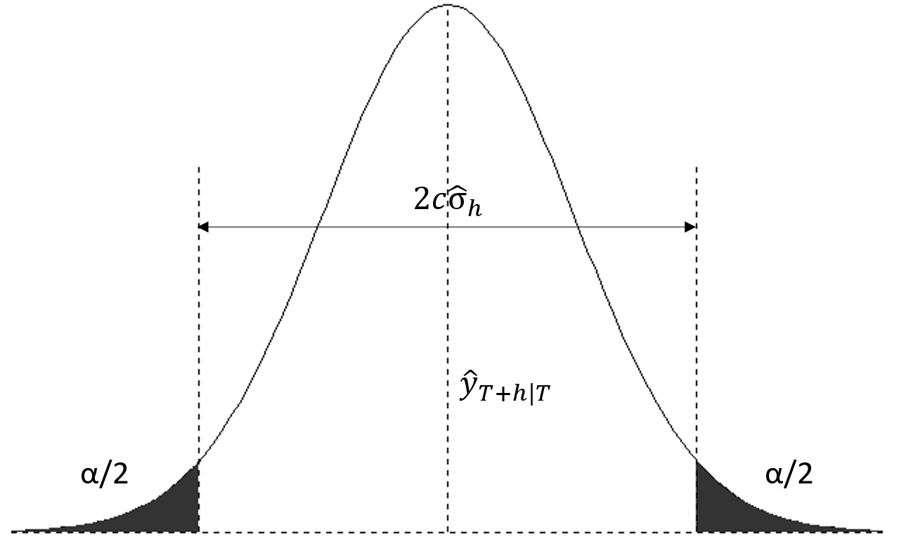

```{r, echo=FALSE, include=FALSE}
library(kableExtra)
```

# References

NOTE: the following material is an adaptation from reference 1 to conduct the classes.

1. Hyndman, R.J., & Athanasopoulos, G., 2021. *Forecasting: principles and practice*. 3rd edition.
2. Fable package documentation
  + https://fable.tidyverts.org/index.html
  + https://fable.tidyverts.org/articles/fable.html
  + https://fable.tidyverts.org/articles/transformations.html
  + https://robjhyndman.com/hyndsight/backtransforming/
  + https://robjhyndman.com/hyndsight/forecasting-within-limits/

# Packages

```{r, error=FALSE, warning=FALSE, message = FALSE}
library(fpp3)
```

```{r, imclude=FALSE, error=FALSE, warning=FALSE, message = FALSE}
#Additional libraries that I do not want interfering with the code
library(patchwork)
library(cowplot)
library(ggdist)
```

# Session 1 reminder: Point forecasts and Forecast Distribution

**$y_t$** random variable to be forecast. Subscript $t$ indicates observation at time $t$

**Prediction interval or interval forecast**: a range of values of $y_t$ with a given probability to occur.

Let us see an example with the data below (trend of internationall arrivals to Australia. Seasonality has been removed):

```{r, echo = FALSE}
aus_arrivals_trend <- aus_arrivals %>%
  filter(Quarter < yearquarter("2005 Q3")) %>%
  summarize(
    Arrivals = sum(Arrivals)
  ) %>%
  model(
    X_13ARIMA_SEATS(Arrivals ~ x11())
  ) %>%
  components() %>%
  select(Quarter, trend)
```


```{r, echo = FALSE}
fit <- aus_arrivals_trend %>%
          model(RW(trend ~ drift()))
  

fc <- fit %>% forecast(h=12)

fc %>% autoplot(aus_arrivals_trend) +
       labs(y = "arrivals to australia",
            title = "Forecast of total international arrivals to Australia")
```
```{r}

```

Let us now focus only on the years we have forecast. The figure below depicts the forecast with 80% and 95% at the top and the corresponding forecast distributions for each year below. Note that the blue area representing the confidence intervals is an *envelope*, it is depicted at continuous but we only have values for the specific quarters, that is, for the points at which we actually have data (in much the same manner as a timeplot is depicted as a continuous line but the underlying data is discrete).

```{r, echo = FALSE, message = FALSE, warning = FALSE}
df <- data.frame(
  # name = paste0(rep("ndist", times=10), "_", as.character(seq(1:10))),
  Quarter = yearquarter("2005 Q3") + seq(0, 11),
  dist = fc %>% pull(trend)
)

#Limit quarters for axis so that graphs align well
limit_qrtr <- as.Date(c(df$Quarter[1], df$Quarter[nrow(df)]+1))

fig1 <- fc %>% autoplot() + 
               theme(legend.position="none") + 
               scale_x_yearquarter(limits = limit_qrtr)  +
               labs(y = "arrivals to australia",
               title = "") +
               ylim(c(700000, 950000))

fig2 <- ggplot(df, aes(x = Quarter)) +
  stat_dist_halfeye(aes(dist = dist)) +
  labs(title = "Focast Distributions", y = NULL, x = NULL) +
  scale_y_continuous(labels = scales::comma) +
  ylim(c(700000, 950000))
  # theme(
  #   # axis.text.x=element_blank()
  # ) 

fig1/fig2
```
```{r}

```


**Forecast Distribution**: let us briefly recap the formal notation established in session 1 (book chapter 1).

* $I$ denotes all the information observed prior to time t.
* $y_t|_I$ is the random variable $y_t$ given what we know in $I$
* The **forecast distribution** is the **probability distribution of $y_t|_I$**, that is the **set of values this random variable could take** along with **their relative probabilities**.
* The **forecast variance** is **var[$y_t|_I$]**

**Point forecast**: the **mean (or median depending on our choice) of $y_t|_I$**:

* When talking about *"the forecast"* we usually refer to point forecasts.
  + We put a $\hat{}$ over $y$ to denote this. 
  + The *forecast of* $y_t$ is $\hat{y_t}$ (the mean o median of the possible values $y_t$ could take (forecast distribution) given what we know in $I$)

**Most important concepts**:

* **Forecast distribution** as the **set of values $y_t|_I$ could take** along with **their relative probabilities**.
* **Point forecast** as the **average value of the forecast distribution**

# Forecst distributions

Most time series models produce **normally distributed forecasts**.

## Prediction intervals

* Interval within which we expect $y_t$ to lie with a specified probability.
* **Assuming a normal forecast distribution** we may build a **two-sided confidence interval for our forecast as follows**:

\[
  \hat{y}_{T+h|T} \pm c \hat\sigma_h,
\]

where:
  
  + $\hat\sigma_h$ is an estimate of the standard deviation of the $h$-step forecast distribution.
  + the multiplier $c$ depends on the **coverage probability** and is equal to the corresponding quantile of the normal distribution. Usually we will compute 80% and 95% intervals, although another coverage may be used.
  
```{r, echo=FALSE, out.width='60%', fig.align="center", fig.cap="Forecast prediction intervals computed from point forecast assuming normal forecast distribution"}

```


```{r, echo=FALSE}
alpha_seq = c(seq(0.50, 0.05, -0.05), seq(0.04, 0.01, -0.01))
perc = numeric(length(alpha_seq))
coef = numeric(length(alpha_seq))

for (i in 1:length(alpha_seq)) {
  perc[i] = 1-alpha_seq[i]
  coef[i] = round(qnorm(1-alpha_seq[i]*0.5, 0, 1), 2)
}

coeffs = tibble(
            alpha = alpha_seq,
            percentage = perc,
            "coefficient `c`" = coef
          )

coeffs %>%
  kbl(caption = "std. normal quantiles") %>%
  kable_styling(bootstrap_options = c("striped", "hover", "condensed", "responsive"), full_width = F)
```
### Intervals for one-step forecasts

When forecasting **one step ahead (h=1)**, the **standard deviation of the forecast distribution** can be **estimated** using the **standard deviation of the residuals:**

\[
  \hat{\sigma} = \sqrt{\frac{1}{T-K}\sum_{t=1}^T e_t^2}, \tag{13.1}
\]

* $T$ is the length of the residuals (after removing NAs).
* $K$ is the number of parameters of the particular model being fitted.

### Intervals for multi-step forecasts

Prediction intervals usually increase in width as the forecast horizon increases. The further ahead we forecast, the more uncertainty associated with the forecast, resulting in wider prediction intervals.

#### Explicit formulas for multi-step forecasts variance

For some methods (e.g. the benchmark methods), it is possible to derive explicit mathematical expressions for the multi-step forecast variance. However it is not always the case that the forecast method of choice has such simple explicit formulas for the forecast variance:

|Benchmark method|h-step forecast standard deviation          |
| -------------- | ------------------------------------------ |
|Mean            |$\hat{\sigma}_h=\hat{\sigma}\sqrt{1+1/T}$   |
|Naïve           |$\hat{\sigma}_h=\hat{\sigma}\sqrt{h}$       |
|Seasonal naïve  |$\hat{\sigma}_h=\hat{\sigma}\sqrt{k+1}$     | 
|Drift           |$\hat{\sigma}_h=\hat{\sigma}\sqrt{h(1+h/T)}$|

* $T$ is the length of the residuals (after removing NAs).
* $h$ - the forecast horizon
* $\hat\sigma$ - standard deviation of the residuals (see equation 13.1)
* $k$ - k is the integer part of $(h-1)/m$, where $m$ is the seasonal period.
  + in other words, $k$ is the number of complete seasonal periods in the forecast prior to time $T+h$

#### More general approach - Bootstrap residuals

In general it is not always possible to generate an explicit expression for the multi-step forecast variance. In these cases we resort to **bootstrapping** to obtain the multi-step forecast variances with a given method. This assumes **uncorrelated residuals with constant variance**

**A dedicated video on this topic will be uploaded as a supplementary topic**, but for the intents an purposes of this course it is sufficient to know how to use the `fable` library to generate the prediction intervals (see next point) and to know how to interpret them.

### Computing prediction intervals with the fable() package

Let us go through a practical example to illustrate how this is done. We will use google stock data for 2015:

```{r}
google_stock <- gafa_stock %>%
  filter(Symbol == "GOOG", year(Date) >= 2015) %>%
  mutate(day = row_number()) %>%
  update_tsibble(index = day, regular = TRUE)

google_2015 <- google_stock %>% filter(year(Date) == 2015) %>%
                  select(Symbol, Date, day, Close)

head(google_2015)
```

#### `hilo()` function to compute confidence intervals

Using the function `hilo()` prediction intervals are automatically computed by the fable library. Without any arguments, it computes the `80%` and `95%` confidence intervals

```{r}
horiz = 5

google_stock <- gafa_stock %>%
  filter(Symbol == "GOOG", year(Date) >= 2015) %>%
  mutate(day = row_number()) %>%
  update_tsibble(index = day, regular = TRUE)

google_2015 <- google_stock %>% filter(year(Date) == 2015)

fit <- google_2015 %>%
        model(NAIVE(Close))

fc <- fit %>%
        forecast(h = horiz)

fc_hilo <- fc %>% hilo()
fc_hilo
```

#### Inspecting the confidence intervals

To extract the limits of the confidence intervals computed using `hilo()` we have a couple alternatives:

1. (Note recommended) extract the particular element of the vector of confidence intervals:

```{r}
# Vector of 80% conf intervals
pints_80 <- fc_hilo %>% pull(`80%`)
pints_80[1]
```
Then we can access the components `lower`, `upper` and `level` using the `$` operator:

```{r}
pints_80[1]$lower # Lower bound of the confidence interval
pints_80[1]$upper # Upper bound of the confidence interval
pints_80[1]$level # Confidence level
```
2. Use the function `unpack_hilo()` to create new columns with the limits of the confidence intervals. In this case new columns `*_lower` and `*_upper` will be created to detail the limits of the confidence intervals we are unpacking. Remember that the column `.mean()` in the forecasts table is the mean of our forecast distribution, that is, 

```{r}
fc_hilo <- fc_hilo %>% 
  unpack_hilo(c(`80%`, `95%`))

fc_hilo %>%
  select(day, .mean, `80%_upper`, `80%_lower`, `95%_lower`, `95%_upper`)
```

#### Check: mean of the forecast distribution (point forecast) is the center of the confidence interval

Importantly, **if the forecast distribution is symmetric** note that the midpoint of the confidence interval is the point forecast (column `.mean` of the fable, indicating it is the mean of the forecast distribution):

```{r}
# Compute midpoints of confidence intervals
midpoints <- fc_hilo %>%
  mutate(midpoints = (`95%_lower` + `95%_upper`)*0.5) %>% # Compute the midpoints of the 95% conf intervals
  pull(midpoints)

# Check that the column .mean is the midpoint of the confidence intervals
# If the sum is 0, then all the elements of both vector are equal.
# Note we used the operator ! (logical)
sum(!(midpoints - (fc_hilo %>% pull(.mean)) == 0))
```
#### Plotting confidence intervals

When plotting the forecasts, the `fable` package prints prediction intervals by defaults unless the argument `level` is set to FALSE

```{r}
fc %>%
  autoplot(google_2015) +
  labs(title="Google daily closing stock price", y="$US" )
```
```{r}

```

Again, let us now zoom in to focus solely on the region we forecasted. The figure below depicts the point forecast (blue line), the 80% and 95% confidence intervals (shaded blue regions) and the forecast distributions underneath. We can see that the model generates normal forecast distributions

```{r, echo=FALSE, warning=FALSE, message=FALSE}
df <- data.frame(
  # name = paste0(rep("ndist", times=10), "_", as.character(seq(1:10))),
  h = seq(253, 253+horiz-1),
  dist = fc %>% pull(Close)
)

fig1 <- fc %>% autoplot() + theme(legend.position="none") + 
        xlim(253, 253+horiz) +
        ylim(680, 850)

fig2 <- ggplot(df, aes(x = h)) +
  stat_dist_halfeye(aes(dist = dist)) +
  labs(title = "Forecast distribution (density)", y = NULL, x = NULL) +
  theme(
    # axis.text.x=element_blank()
  ) +
  ylim(680, 850)

# plot_grid(fig1, fig2, ncol = 1, align = "V")
fig1 / fig2
```
```{r}

```

#### Extracting parameters from forecast distributions

By now you should have noticed that, when generating forecasts, there is a column of type `<S3 Distribution>`. This column contains the information about the forecast distributions at each forecast horizon. The column always has the name of the response variable (the y variable) of the time series, in this case `Close`

```{r}
fc %>% select(day, Close)
```
We can compute the parameters of our distribution using the function `parameters` within the package `distributional`. You may need to install that package. Here, in order to avoid loading the package, we will make an explicit reference to the package when calling the function

```{r}
fc %>% pull(Close) %>% distributional::parameters()
```
#### Check: manual computation of confidence intervals vs `hilo()` computation

Let us, as an example, compute manually the 95% prediction interval for the 1-step forecast of the exampla above (the google stock prices of 2015).

We noted before that, **for a 1-step ahead confidence interval, the std. deviation of the forecast distribution can be estimated from the std. deviation of the residuals**:

\[
  \hat{\sigma} = \sqrt{\frac{1}{T-K}\sum_{t=1}^T e_t^2}, \tag{13.1}
\]

* $T$ is the length of the residuals (after removing NAs).
* $K$ is the number of parameters of the particular model being fitted

Using the formula above:

```{r}
# Extract the residuals
res <- fit %>% augment() %>% pull(.innov)
# Remove missing values before computing the length
res <- res[!is.na(res)]

# Compute T and K
T = length(res) # T number of points in the residuals
K = nrow(tidy(fit)) # K number of parameters in our model

sigma_res = sqrt(sum(res^2, na.rm=TRUE)/(T-K))

# Check whether our result matches the std. deviation of the forecast distribution
sigma_res
sigma_res == distributional::parameters(fc$Close[1])$sigma
```
With this information we can compute the confidence interval based on the point forecast (in this case the mean of the forecast distribution) and applying the formula:

\[
  \hat{y}_{T+h|T} \pm c \hat\sigma_h,
\]

where:
  
  + $\hat\sigma_h$ is an estimate of the standard deviation of the $h$-step forecast distribution.
  + the multiplier $c$ depends on the **coverage probability** and is equal to the corresponding quantile of the normal distribution. Usually we will compute 80% and 95% intervals, although another coverage may be used.
  
```{r, echo=FALSE, out.width='40%', fig.align="center", fig.cap="Forecast prediction intervals computed from point forecast assuming normal forecast distribution"}

```
If we want a 95% confidence interval, that means we need the quantile corresponding to $1-0.05/2 = 97.5%$ of the normal distribution (see table at the beginning of this notebook)


```{r}
# Point forecaset, which in this case is the mean of the forecast distribution
y_hat <- fc$.mean[1]

# Quantile of the normal distribution
alpha = 0.05 # 95% confidence interval
quant = qnorm(1-alpha*0.5, 0, 1)

# Confidence interval computed manually
CI <- c(y_hat - quant*sigma_res, y_hat + quant*sigma_res)

# Confidence interval computed by fable library
CI_hilo <- c(fc_hilo$`95%_lower`[1], fc_hilo$`95%_upper`[1])

# Check of the value of the CI and that both CIs match
CI
round(CI, 4) == round(CI_hilo, 4)
```
We can therefore see that how `hilo()` is computing the confidence intervals.

To compute intervals beyond a horizon of 1, we need to have the value of the estimation of the std. deviation of the forecast distribution for the particular forecast horizon. As we noted previously in this notebook, explicit formulas exist for the benchmark methods (Mean, Naive, SNaive and Drift). For more complex methods there is not such a general solution.

Prediction intervals can also be computed from bootstrapped residuals as we noted at the beginning of the notebook. There is a dedicated lesson to that particular process.

# Forecasting and transformations

When performing a transformation on the data:

1. We produce forecasts of the transformed data.
2. To recover the magnitudes of interest, we need to **back-transform** to obtain forecasts on the origitnal scale.

The box-cox transformation admits an explicit inverse, so this could also be performed manually (although this is not recommended)

\[
\tag{5.2}
  y_{t} =
    \begin{cases}
      \exp(w_{t}) & \text{if $\lambda=0$};\\
      \text{sign}(\lambda w_t+1)|\lambda w_t+1|^{1/\lambda} & \text{otherwise}.
    \end{cases}
\]

where:

* $\hat{w}_{T+h|T}$ is the $h$-step forecast mean
* $\sigma_h^2$ is the $h$-step forecast variance on the transformed scale.

The `fable` package **performs this back-transformations automatically if the transformation has been used in the model definition**.

## Prediction intervals and tranformations

The forecast distribution is also transformed when reversing the transformation. 

* The end points of the prediction intervals are back-transformed to give a prediction interval on the original scale. This preserves the **probability coverage** of the prediction interval, but **the prediction interval will no longer be symmetric around the point forecast**. Or in other words, **the back-transformed forecast will in general not be the mean of the forecast distribution**.

* **If the forecast distribution in the transformed space is symmetric**: the **back transformed forecast will be the median** of the forecast distribution in the original space (original variables).
  + Using the median may be acceptable in many forecasting sitations.
  + Some situations may require properties of the mean that are not shared with the median. For example, adding sales forecasts for various regions requires using the mean of the forecast distribution and not the median, because **medians do not add up**
  + The **larger the forecast variance, the bigger the difference between the mean and the median**. This can be concluded from the formulas of the inverse of the box-cox transformation.
  + The difference between the back-transformed forecast and the mean is called the **bias**. When using the mean rather than the median, we say the point forecasts have been **bias-adjusted**.
  
The back-transformations computed automatically by `fable achieve the following`:

1. **Forecast are returned in the original domain rather than in the transformed domain** (provided that the transformation has been properly specified upon model definition).
2. **Forecast medians are automatically converted into forecast means.**
  
The following example illustrates three important points:

1. How the log transformation is applied upon defining the model rather than before so that the `fable` package is able to perform the back transformation automatically
2. The code to tell the fable package to depict both the mean and median point forecasts of the back transformed forecast distributions
3. **Perhaps most importantly**: you can see that **the back transformed forecast distribution is not symmetric**. The mean does not coincide with the median and neither the mean nor the median coincide with the midpoint of the domain of the forecast distribution.

```{r}
# Create a new column to hold the transformed variable
prices <- prices %>%
  mutate(log_eggs = log(eggs))
```

```{r, warnings=FALSE}
# forecast horizon
horiz = 50

# Model 1: fitted to the variable already transformed
fit1 <- prices %>%
  filter(!is.na(eggs)) %>%
  model(drift = RW(log_eggs ~ drift()))

# fc1: forecasts generated with model 1
fc1 <- fit1 %>%
  forecast(h = horiz)

# Model 2: fitted to the original variable specifying the transformation upon model definition
fit2 <- prices %>%
  filter(!is.na(eggs)) %>% # This line simply selects values that are not NAs from the time series
  model(RW(log(eggs) ~ drift()))
 
# fc2: forecasts generated with model 2
fc2 <- fit2 %>%
  forecast(h = horiz)

# figures for each model
fig1 <- fc1 %>%
  autoplot(prices %>% filter(!is.na(eggs)),
           level = 80, point_forecast = lst(mean, median) # Depict both mean and median in the back transformed forecasts
           ) +
  labs(title = "log(Annual egg prices)",
       y = "log($US cents infl. adj)") +
  theme(legend.position="none") # Remove legend for mean and median to have more space for the plots

fig2 <- fc2 %>%
  autoplot(prices %>% filter(!is.na(eggs)),
           level = 80, point_forecast = lst(mean, median) # Depict both mean and median in the back transformed forecasts
           ) +
  labs(title = "Annual egg prices",
       y = "$US cents infl. adj") +
  theme(legend.position="none") # Remove legend for mean and median to have more space for the plots

fig1 + fig2 
```
```{r}

```

In the above graph: 

* The right side depicts the series and the forecasts in the original domain, once everything has been back-transformed. The mean of the forecast distribution is represented by the continuous blue line, will the median is represented by the dashed line. The further ahead into the future, the greater the divergence between these two values. It is clear that these forecast distributions are not symmetric.
* The left side represents the series and the forecasts in the transformed domain. We can see that the mean coincides with the median, i.e., the forecast distribution in the transformed domain is symmetric. It is when back-transforming that this symmetry is lost.

The figure below focuses only on the forecasted values and shows the forecast distributions on the transformed domain (left) and on the original domain (right), to further emphasize this loss of symmetry in the forecast distribution. 

* Remember that the coverage of the prediction intervals computed in the transformed domain is preserved when back-transforming. The difference now is that, in the original domain, these prediction intervals are not symmetric around the mean of the forecast distribution as they are in the transformed domain.

```{r, echo=FALSE, warning=FALSE, message=FALSE}
cut_year = 8

# Forecast figures
fc1_fig <- fc1 %>%
              slice(1:cut_year) %>%
              autoplot(level = 80, point_forecast = lst(mean, median)) +
              xlim(fc1$year[1], fc1$year[cut_year] + 1) +
              theme(legend.position="none") +
              labs(title = "log(Annual egg prices)",
              y = "log($US cents infl. adj))") +
              ylim(c(3, 5))

fc2_fig <- fc2 %>%
              slice(1:cut_year) %>%
              autoplot(level = 80, point_forecast = lst(mean, median)) +
              xlim(fc2$year[1], fc2$year[cut_year] + 1) +
              theme(legend.position="none") +
              labs(title = "Annual egg prices",
              y = "$US cents infl. adj") +
              ylim(c(10, 120))

# Distribution figures
df1 <- data.frame(
  # name = paste0(rep("eggs", times=horiz), "_", as.character(seq(1:horiz))),
  year = seq(fc1$year[1], fc1$year[cut_year]),
  dist = fc1 %>% slice(1:cut_year) %>% pull(log_eggs)
)


fd1_fig <- ggplot(df1, aes(x = year)) +
  stat_dist_halfeye(aes(dist = dist)) +
  labs(title = "Forecast Distr (density)", y = NULL, x = NULL) +
  theme(
    # axis.text.x=element_blank()
  ) +
  ylim(c(3, 5))

df2 <- data.frame(
  # name = paste0(rep("eggs", times=horiz), "_", as.character(seq(1:horiz))),
  year = seq(fc2$year[1], fc2$year[cut_year]),
  dist = fc2 %>% slice(1:cut_year) %>% pull(eggs)
)


fd2_fig <- ggplot(df2, aes(x = year)) +
  stat_dist_halfeye(aes(dist = dist)) +
  labs(title = "Forecast Distr (density)", y = NULL, x = NULL) +
  theme(
    # axis.text.x=element_blank()
  ) +
  ylim(c(10, 120))


fc1_fig + fc2_fig +fd1_fig + fd2_fig
```
```{r}

```

#### Understanding forecasts returned when using transformations

Remember that, in the previous example, we have fitted two models:

* **Model 1**: fitted to the transformed variable `log_eggs = log(eggs)`

```{r, eval=FALSE}
# Model 1: fitted to the variable already transformed
fit1 <- prices %>%
  filter(!is.na(eggs)) %>%
  model(drift = RW(log_eggs ~ drift()))
```

* **Model 2**: fitted to the original variable, detailing the transformation upon model definition:

```{r, eval=FALSE}
# Model 2: fitted to the original variable specifying the transformation upon model definition
fit2 <- prices %>%
  filter(!is.na(eggs)) %>% # This line simply selects values that are not NAs from the time series
  model(RW(log(eggs) ~ drift()))
```

See the code snippets above for further details. With those models we generated two forecast objects: 

* `fc1`, generated using model 1. Therefore it returns forecasts in the transformed domain (it is working with the transformed variable directly).

```{r}
head(fc1, 4)
```

* `fc2`  generated using model 2. `fable` knows we have applied a transformation in model2 and is therefore capable of back-transforming to the original domain. It does so and returns **forecasts that are bias-adjusted**, i.e., it returns the mean of the back-transformed forecast distribution (column .mean)

```{r}
head(fc2, 4)
```
We can actually check it by computing the `mean()` and the `median()` of the associated distribution object:

```{r}
# First distribution object
dist_h1 <- fc2$eggs[1]

mean(dist_h1)
median(dist_h1)
fc2$.mean[1]
```
As we can see above, the fable package is automatically returning bias adjusted forecasts (forecasts on the mean). If we want forecast on the median, we can compute them by computing the median of the forecast distributions. The following returns the median of all the forecast distributions (the median for every forecast horizon).

* NOTE: remember that the column `eggs` of the object fc2 holds the distribution objects.

```{r}
median(fc2$eggs)
```

# Exercise 1

Use `decomposition_model()` in combination with an STL decomposition and a log transformation to generate a 36 step-forecast of the retail_series used in exercise 1 of notebook 6_1. Back transform the result to the original variables depicting both the mean and median point forecasts.

As in notebook 6_1, use a drift model to fit the seasonally adjusted data and a seasonal naive model to fit the seasonal component.

```{r}
retail_series <- aus_retail %>%
  filter(`Series ID` == "A3349767W")
```

```{r, include = params$print_sol}
forecast <- retail_series %>%
            model(stlf = decomposition_model(
                STL(log(Turnover) ~ trend(window = 7), robust = TRUE), # Details how to decompose the series
                RW(season_adjust ~ drift()) # Details model for the seasonally adjusted component
            )) %>%
            forecast(h = 36)

autoplot(forecast, retail_series, level = 80, point_forecast = lst(mean, median))
```