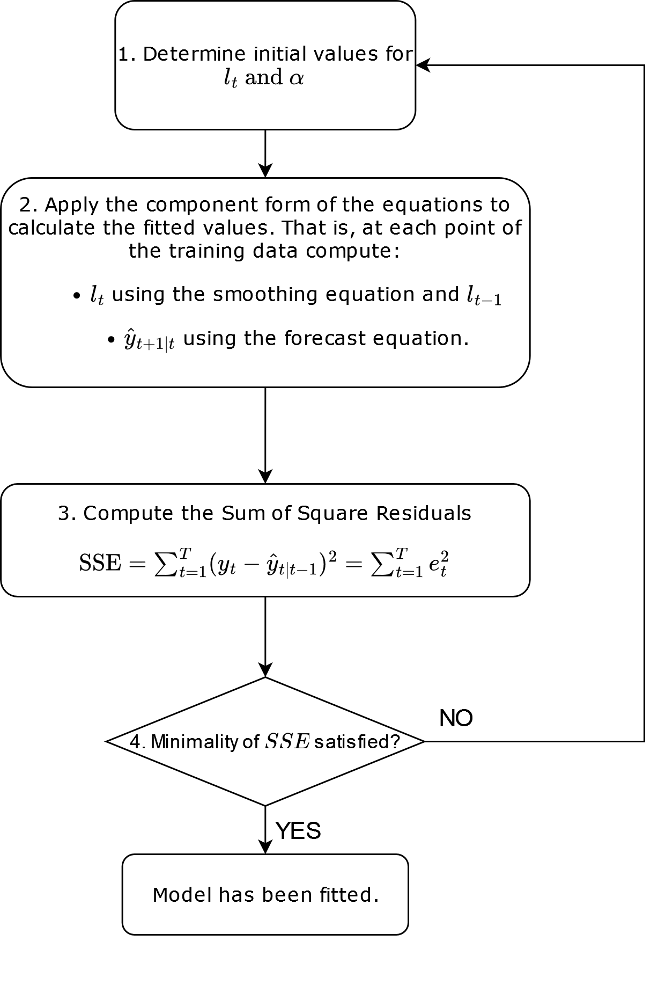

# References

1.  Hyndman, R.J., & Athanasopoulos, G., 2021. *Forecasting: principles and practice*. 3rd edition.
2.  Fable package documentation

-   <https://fable.tidyverts.org/index.html>
-   <https://fable.tidyverts.org/articles/fable.html>

# Note

This notebook is not original material, but rather based on ref. 1 with notes expanding on some of the concepts contained in the book.

# Libraries

```{r, warning= FALSE, message=FALSE}
library(fpp3)
library(patchwork) # to easily locate graphs next to each other
```

# Exponential Smoothing - Intro

**Exponential smoothing forecasts, main idea**

-   Weighted averages of past observations with weights decaying exponentially as the observations get older.
    -   The more recent the observation, the higher its associated weight.

# Simple Exponential Smoothing (SES)

**USE:** data with **no clear trend or seasonal pattern**.

Example:

```{r}
algeria_economy <- global_economy %>%
  filter(Country == "Algeria")

algeria_economy %>%
  autoplot(Exports) +
  labs(y = "% of GDP", title = "Exports: Algeria")
```

Data above does not have clear trend or seasonality. Among the benchmark methods, **naïve or mean methods** would be suitable for this data.

## Naïve vs. Average vs. Simple Exponential Smoothing

### Naïve

All future forecasts are equal to the last observed value. **The most recent observation is the only important one**.

$$
\hat{y}_{T+h|T} = y_{T}
$$

-   for $h = 1, 2, \dots$

### Average method

All future forecasts are equal to a simple average of the observed data. **All observations are of equal importants, assigning them equal weights when generating the forecasts**

$$
\hat{y}_{T+h|T} = \frac1T \sum_{t=1}^T y_t
$$

-   for $h = 1, 2, \dots$

### Simple Exponential Smoothing

Between the naive and the average approach.

-   **Forecasts = weighted averages**.

    -   More recent observations have larger weights associated.
    -   Weights decrease exponentially the more distant in the past the observations.

$$
    \hat{y}_{T+1|T} = \alpha y_T + \alpha(1-\alpha) y_{T-1} + \alpha(1-\alpha)^2 y_{T-2}+ \cdots = \sum_{j=0}^{T-1} \alpha(1-\alpha)^j y_{T-j} \tag{1}
$$

#### Flat forecasts of simple exponential smoothing

Simple Exponential Smoothing has a "flat" forecast function. **All forecasts beyond the training data take the same value, equal to the last level component**

$$
\hat{y}_{T+h|T} = \hat{y}_{T+1|T} =  \sum_{j=0}^{T-1} \alpha(1-\alpha)^j y_{T-j} \tag{1} \qquad h=2,3,\dots.
$$

-   These forecasts will only be suitable if the time series has no trend or seasonal component

The **fitted values** on the other hand **will not be constant**. They will be *one-step ahead forecasts* based on all the preceding datapoints. Continue reading to see how we will compute them.

An example at the end of the notebook will clarify this matter further.

#### Coefficients of the weighted average

-   $0 \le \alpha \le 1$

-   **One-step ahead forecast for time** $T+1$: weighted average **of all of the observations** $y_1,\dots,y_T$

-   $\alpha$ is the parameter controlling the **rate at which weights decrease**.

    -   **If** $\alpha$ is small (close to 0), more weight is given to observations from the more distant past.
    -   **If** $\alpha$ is large (close to 1), more weight is given to observations to more recent observations.
    -   **If** $\alpha = 1$, then $\hat{y}_{T+1|T}=y_T$ and the model becomes the naïve method.

-   The table below shows the weights attached to 5 observations for four different values of \alpha when forecasting using simple exponential smoothing.

|           | $\alpha=0.2$ | $\alpha=0.4$ | $\alpha=0.6$ | $\alpha=0.8$ |
|:----------|:-------------|:-------------|:-------------|:-------------|
| $y_{T}$   | 0.2000       | 0.4000       | 0.6000       | 0.8000       |
| $y_{T-1}$ | 0.1600       | 0.2400       | 0.2400       | 0.1600       |
| $y_{T-2}$ | 0.1280       | 0.1440       | 0.0960       | 0.0320       |
| $y_{T-3}$ | 0.1024       | 0.0864       | 0.0384       | 0.0064       |
| $y_{T-4}$ | 0.0819       | 0.0518       | 0.0154       | 0.0013       |
| $y_{T-5}$ | 0.0655       | 0.0311       | 0.0061       | 0.0003       |

-   The coefficients extend until the first term of the series.

-   **As the table above shows, if the series is sufficiently long, the sum of the coefficients of the simple exponential smoothing method is close to one**. In the limit, for $T\rightarrow \infty$ the sum of the coefficients is one. Lets examine this:

$$
\sum_{i=0}^{T-1}\alpha(1-\alpha)^j
$$

This corresponds to a geometric progression of ratio $1-\alpha \leq 1$. Therefore it has a finite sum hat we can compute as follows:

$S_n = \alpha+\alpha(1-\alpha)+\alpha(1-\alpha)^2+\dots+\alpha(1-\alpha)^{T-1} \tag{2}$ 

$(1-\alpha) S_n = \alpha(1-\alpha)+\alpha(1-\alpha)^2+\dots+\alpha(1-\alpha)^{T-1}+\alpha(1-\alpha)^{T} \tag{3}$

Substracting (2) - (3) we obtain: 

$$
\alpha-\alpha(1-\alpha)^{T} = S_n(1-(1-\alpha))=S_n\alpha \;\;\;\;\;\;\;\;(2)-(3)
$$

Hence, since $(1-\alpha)$ is smaller than 1, then $(1-\alpha)^T\xrightarrow[T \to \infty]{}0$ and we finally obtain:

$$
Sn = 1-(1-\alpha)^T \xrightarrow[T \to \infty]{} 1
$$

Now two forms of simple exponential smoothing are presented and it is shown that both are equivalent to the forecast equation (1),

#### Weighted average form and fitted values

From eq (1) we have:

$$
    \hat{y}_{T+1|T} = \alpha y_T + \alpha(1-\alpha) y_{T-1} + \alpha(1-\alpha)^2 y_{T-2}+ \cdots = \sum_{j=0}^{T-1} \alpha(1-\alpha)^j y_{T-j} \tag{1}
$$

Substituting $T$ by $T-1$ we obtain the following expression:

$$
    \hat{y}_{T|T-1} = \alpha y_{T-1} + \alpha(1-\alpha) y_{T-2} + \alpha(1-\alpha)^2 y_{T-3}+ \cdots = \sum_{j=0}^{T-2} \alpha(1-\alpha)^j y_{T-1-j} \tag{1*}
$$

Comparing $(1)$ and $(1*)$ we see that the forecast at time $T+1$ is in fact a weighted average between the most recent observation $y_T$ and the previous forecast. That is, if we multiply equation $(1*)$ by $(1-\alpha)$ and add to it $\alpha y_t$, we recover equation $(1)$

$$
\hat{y}_{T+1|T} = \alpha y_T + (1-\alpha) \hat{y}_{T|T-1}\\ \tag{1**}
$$

-   $\hat{y}_{T+1|T}$ forecast at time T+1
-   $y_T$ is the most recent observation
-   $\hat{y}_{T|T-1}$ is the previous forecast
-   $\alpha$ is the smoothing parameter.

Equation $(1**)$ is simply another way to write $(1)$, but it provides us with a simple equation for one-step ahead forecasts. Since **fitted values** are one-step forecasts on the training data to which the model is fitted, we may use $(1**)$ to express the fitted values as follows:

$$
\hat{y}_{t+1|t} = \alpha y_t + (1-\alpha) \hat{y}_{t|t-1}
$$

-   for $t = 1, \dots, T$ (for the values of $t$ that encompass the training data).

We can write this equation for each of the fitted values. However, **the first fitted value at time 1**, denoted by $l_0$, needs to be estimated or the process cannot start, since the equation relies on the fitted value at time $t$ ($\hat{y}_{t|t-1}$) to compute the fitted value at $t+1$ ($\hat{y}_{t+1|t}$). 

Once we estimate $l_0$, we may write the following equation for each of the fitted values:

```{=tex}
\begin{align*}
  \hat{y}_{2|1} &= \alpha y_1 + (1-\alpha) \ell_0\\
  \hat{y}_{3|2} &= \alpha y_2 + (1-\alpha) \hat{y}_{2|1}\\
  \hat{y}_{4|3} &= \alpha y_3 + (1-\alpha) \hat{y}_{3|2}\\
  \vdots\\
  \hat{y}_{T|T-1} &= \alpha y_{T-1} + (1-\alpha) \hat{y}_{T-1|T-2}\\
  \hat{y}_{T+1|T} &= \alpha y_T + (1-\alpha) \hat{y}_{T|T-1}.
\end{align*}
```

Now, substituting each equation into the following equation, we reach:

```{=tex}
\begin{align*}
  \hat{y}_{3|2}   & = \alpha y_2 + (1-\alpha) \left[\alpha y_1 + (1-\alpha) \ell_0\right]              \\
                 & = \alpha y_2 + \alpha(1-\alpha) y_1 + (1-\alpha)^2 \ell_0                          \\
  \hat{y}_{4|3}   & = \alpha y_3 + (1-\alpha) [\alpha y_2 + \alpha(1-\alpha) y_1 + (1-\alpha)^2 \ell_0]\\
                 & = \alpha y_3 + \alpha(1-\alpha) y_2 + \alpha(1-\alpha)^2 y_1 + (1-\alpha)^3 \ell_0 \\
                 & ~~\vdots                                                                           \\
  \hat{y}_{T+1|T} & =  \sum_{j=0}^{T-1} \alpha(1-\alpha)^j y_{T-j} + (1-\alpha)^T \ell_{0} \tag{4}.
\end{align*}
```

Since $1-\alpha \leq 1$, the last term becomes tiny for large enough $T$ and equation (4) converges equation (1).

In this manner we have obtained a simple form to compute the fitted values based on an initial estimation $l_0$.

#### Component form

This form is more useful from a computational standpoint. For Simple Exponential Smoothing it might seem unnecessary, but it will be mot convenient when more components are added.

For simple exponential smoothing, the component form consists of:

1.  A forecast equation
2.  A smoothing equation for each of the components included in the method.

The forecast equation can be deduced from the fact that for simple exponential smoothing the forecasts will be flat, so the forecast equation will simply be:

```{=tex}
\begin{align*}
\text{Forecast equation}  && \hat{y}_{t+h|t} & = \ell_{t}
\end{align*}
```

where: 

* $l_t$ is the level of the time series at time $t$. Think of it as the smoothed value of the time series at time t. Continue reading if this does not makes much sense at the current point.

To obtain the smoothing equation, we start with the equation we used for the fitted values:

$$
\hat{y}_{t+1|t} = \alpha y_t + (1-\alpha) \hat{y}_{t|t-1}
$$

We may now substitute $\hat{y}_{t|t-1}$ by $l_{t-1}$ and $\hat{y}_{t+1|t}$ by $l_{t$}, thereby obtaining the smoothing equation:

```{=tex}
\begin{align*}
  \text{Smoothing equation} && \ell_{t}        & = \alpha y_{t} + (1 - \alpha)\ell_{t-1},
\end{align*}
```

-   $l_t$ is the level (or smoothed value) of the series at time $t$.

Together, they constitute the **component form of simple exponential smoothing**.

```{=tex}
\begin{align*}
  \text{Forecast equation}  && \hat{y}_{t+h|t} & = \ell_{t}\\
  \text{Smoothing equation} && \ell_{t}        & = \alpha y_{t} + (1 - \alpha)\ell_{t-1},
\end{align*}
```

**IMPORTANT:**
-   setting $h=1$ gives the fitted values.
-   setting $t=T$ gives the true forecasts beyond the trainig data.

For simple exponential smoothing the equations can be interpreted as follows:

-   **The forecast equation** shows that the forecast value at time $t+1$ is the estimated level at time $t$
-   **The smoothing equation for the level** (a.k.a level equation) gives the estimated level of the series at time t.

#### Flat forecasts of simple exponential smoothing

Simple Exponential Smoothing has a "flat" forecast function:

$$
\hat{y}_{T+h|T} = \hat{y}_{T+1|T}=\ell_T, \qquad h=2,3,\dots.
$$

**All forecasts beyond the training data take the same value, equal to the last level component, the smoothed value.**

-   Since the forecasts are constant, SES will only be suitable if the time series has no trend or seasonal component.

An example at the end of the notebook will clarify this matter further.

#### Optimisation

To apply any exponential smoothing method some choices need to be made. Specifically:

-   The smoothing parameters
-   The initial values.

For simple exponential smoothing, these values are: 

-   $\alpha$ (the smoothing paramenter) 
-   $l_0$ (the initial level or first fitted value)

For more complex exponential smoothing methods there will be more than one smoothing parameter and more than one initial component.

**Choice of parameters**

-   Sometimes previous experience guides the choice of these paramenters
-   Usually the observed data is used to estimate them.
    -   The **sum of squared residuals** is minimized to choose these parameters. 
        -   NOTE: the **sum of squared residuals** is usually known as the **sum of squared errors (SSE)**, although technically residuals $\neq$ errors.

$$
  \text{Residuals} = e_t=y_t - \hat{y}_{t|t-1}\\
  \text{SSE} = \sum_{t=1}^T(y_t - \hat{y}_{t|t-1})^2=\sum_{t=1}^Te_t^2.
$$

For Simple Exponential Smoothing this is a non-linear minimisation problem and requires the use of an external algorithm to perform the minimisation of SSE. The process could be summarized as follows:

```{r, echo=FALSE, out.width='70%', fig.align="center", fig.cap=""}

```

You may recall that for Linear Regression there are explicit formulas providing the solution to this problem. This is not the case in SES.

#### Model specification in `fable()` - example

Exponential Smoothing Methods can be fitted using the `ETS()` function of the `fable` library.

-   **`ETS()`** returns an ETS model specified by the formula specified via its arguments
-   **model()** (also from `fable`) trains the specified model definition to a given dataset.

The details of these functions can be queried using ?ETS() or ?model() in the console, but it is best to examine their use through an example. We wilñ resort to the example of the Algerian economy we were dealing with before.

```{r}
# Estimate parameters
fit <- algeria_economy %>%
  model(ETS(Exports ~ error("A") + trend("N") + season("N")))
```

Remember that, when fitting the model, a value for $\alpha$ and $l_{t0}$ (initial level) has been internally chosen by minimizing the sum of square errors. These are the model parameters for simple exponential smoothing and can be queried using the function `tidy()` on the model:

```{r}
# Print out the model parameters
tidy(fit)
```

In this case we have $\alpha = 0.84$ and $l_{t0} = 39.54$.

Once the model has been fitted, we can use `augment()` as usual to examine the fitted values and the residuals:

```{r}
fit %>% augment() %>% select(Year, Exports, .fitted)
```

With these values, we can reverse the process and understand the computation that took place taking into account the component form of the equations and the following facts:

-   Fitted values can be understood has 1-step forecasts on the training data $y_{t|t-1}$
-   The initial level has been chosen by the function by minimizing the sum of square errors.

Taking this into account we may build the following **table for the fitted values** (this corresponds to step 2. of the diagram showing the process required to fit an SES model):

| Year | Time | Observation | Level | Forecast          |
|:-----|:-----|:------------|:------|:------------------|
|      | $t$  | $y_t$       | $l_t$ | $\hat{y}_{t|t-1}$ |
| 1959 | 0    |             | 39.54 |                   |
| 1960 | 1    | 39.04       | 39.12 | 39.54             |
| 1961 | 2    | 46.24       | 45.10 | 39.12             |
| 1962 | 3    | 19.79       | 23.84 | 45.10             |
| 1963 | 4    | 24.68       | 24.55 | 23.84             |
| 1964 | 5    | 25.08       | 25.00 | 24.55             |
| 1965 | 6    | 22.60       | 22.99 | 25.00             |
| 1966 | 7    | 25.99       | 25.51 | 22.99             |
| 1967 | 8    | 23.43       | 23.77 | 25.51             |
|      | ⋮    | ⋮           | ⋮     | ⋮                 |
| 2014 | 55   | 30.22       | 30.80 | 33.85             |
| 2015 | 56   | 23.17       | 24.39 | 30.80             |
| 2016 | 57   | 20.86       | 21.43 | 24.39             |
| 2017 | 58   | 22.64       | 22.44 | 21.43             |


Once the model has been fit, we may produce forecasts with the usual syntax:

```{r}
# Generate 5 step forecasts
fc <- fit %>%
  forecast(h = 5)
```

```{r}
fc %>%
  autoplot(algeria_economy) +
  geom_line(aes(y = .fitted), col="#D55E00",
            data = augment(fit)) +
  labs(y="% of GDP", title="Exports: Algeria") +
  guides(colour = "none")
```

We may build a similar table for our forecasts:

| Year | Time | Observation | Level | Forecast                |
|:-----|:-----|:------------|:------|:------------------------|
|      | $h$  |             |       | $\hat{y}_{T+h\vert{T}}$ |
| 2018 | 1    |             |       | 22.44                   |
| 2019 | 2    |             |       | 22.44                   |
| 2020 | 3    |             |       | 22.44                   |
| 2021 | 4    |             |       | 22.44                   |
| 2022 | 5    |             |       | 22.44                   |

It is now clear that, beyond the training data, forecasts become "flat" for the simple exponential smoothing algorithm.

# Summary

-   Exponential smoothing generates forecasts as weighted averages.
    -   More recent observations have larger weights associated to them
    -   Weights decrease exponentially the more distant in the past the observations.
    
-   Simple Exponential Smoothing
    -   May be used for **data with no clear trend or seasonal pattern**
    -   In-between the **naïve** and the **average** method.
    -   Fitting the model requires minimizing the SSE to determine the values of $\alpha$ and $l_{t0}$ (model parameters)
    -   This optimization is performed automatically by the `fable()` library, with the possibility of tweaking the optimization criteria.
    -   The simple exponential smoothing produces forecasts that are flat in nature and equal to the last level component. Hence it is only suitable if the time series has no trend or seasonal component.
